# 마인드로 AgenticWorld 구축

> This project documentation is available in multiple languages, and you are welcome to improve or add new language version via Pull Request. 
<p align="center">
  🇬🇧 <a href="./README.md">English</a> | 
  🇰🇷 <a href="./README-KR.md"><strong>한국어 (Korean)</strong></a> | 
  🇨🇳 <a href="./README-ZH.md">中文 (Chinese)</a>
</p>

AgenticWorld 의 진화 과정을 살펴보겠습니다. Mind Network 의 아키텍처가 초기 개념에서 현재 형태에 이르기까지 어떻게 발전했는지 살펴보겠습니다 . 이 아키텍처는 Agentic AI의 보안, 자율성, 신뢰에 기반을 두고 있습니다.

## AgenticWorld 구축의 동기

우리는 과거 기술 혁명의 물결을 거쳤으며, 오늘날 에이전트 AI 시대를 굳게 믿고 있습니다. MAGA ( 마이크로소프트 , 애플 , 구글 , 아마존 )가 AI에 대한 잘못된 투자를 하지 않는 한, 가까운 미래에 우리 각자는 하나 이상의 에이전트 AI를 소유하고 그들에게 업무를 위임하게 될 것이라고 가정해도 과언이 아닙니다. 이러한 에이전트들은 우리를 대신하여 서로 협력하며, 자율적으로 작업하고, 협상하고, 결정을 내릴 것입니다.

그렇다면 에이전트 AI의 세계는 어떤 모습일까요? 에이전트 월드일까요 ?

AgenticWorld라는 용어는 우리가 만든 것이 아닙니다 . Microsoft Ignite 2024에서 사티아 나델라는 기조 연설 에서 다음과 같이 말했습니다 .

> "이 모든 것을 합치면 매우 풍부한 AgenticWorld를 만들 수 있습니다 ."

사티아 나델라가 이러한 미래를 위해 마이크로소프트를 혁신하고 , 샘 알트만은 사회를 그 미래로 이끌어갈 " 월드 앱 "을 개발하고 있다면 , AgenticWorld 의 인프라 구축에 우리 모두가 참여해야 할 역할과 책임이 있다는 것은 분명합니다 .

우리는 가장 중요한 기반 중 하나인 보안 에 집중합니다 .

AI 에이전트에서 에이전트 AI로의 핵심 도약은 자율성, 즉 인간의 개입을 줄이는 것입니다. 그러나 이러한 자율성은 다음과 같은 심각한 우려를 불러일으킵니다.

- 우리는 다른 대리인에게 조종당하지 않고 대리인이 우리를 대신하여 결정을 내릴 수 있다고 믿을 수 있을까?

- 그들이 우리의 비밀을 누설하지 않고도 소통할 수 있다고 믿을 수 있을까?

더욱 안전한 AgenticWorld를 구축하려면 암호화 , 검증 , 합의를 위한 강력한 메커니즘이 필요합니다 . 수년간의 연구 끝에 완전 동형 암호화(FHE)가 가장 유망한 솔루션임을 확인했습니다 .

FHE 는 신생 기술이 아닙니다. 1978년에 처음 제안되었으며, 그 이후로 생태계는 상당히 성숙해졌습니다. 마인드 네트워크(Mind Network) 는 지난 3년 동안 보안 데이터 레이크 부터 크로스 체인 브리지 , 비밀 투표에 이르기까지 다양한 블록체인 사용 사례를 위한 FHE 기반 애플리케이션을 개발해 왔습니다 .

2024년부터 우리 커뮤니티에서 새로운 질문이 생겨났습니다.
FHE를 AI에 적용해 보는 건 어떨까요?
그 질문은 저희 여정의 새로운 장을 열었습니다. FHE 기반 모델 선택 , 예측 합의 , 그리고 궁극적으로 에이전트 합의를 실험하기 시작했습니다 . 이를 통해 에이전트는 내부 논리를 노출하거나 개인정보를 침해하지 않고 안전하고 검증 가능한 결정을 내릴 수 있게 되었습니다.
다음에서는 FHE 가 AgenticWorld 아키텍처에 왜 중요한지 , 그리고 Agentic AI의 안전하고 협업적인 미래를 구현하기 위해 FHE를 어떻게 설계했는지 살펴보겠습니다.

## AgenticWorld 의 순진하지만 흔한 시나리오

AgenticWorld 의 아키텍처를 본격적으로 살펴보기 전에 , 간단하지만 놀라울 정도로 현실적인 시나리오를 통해 논의의 토대를 마련해 보겠습니다. 이 예시는 언뜻 보기에는 순진해 보일 수 있지만, 에이전트 AI가 안전하고 효율적으로 작동하기 위해 해결해야 할 핵심 과제들을 잘 보여줍니다.
읽으면서 이것을 여러분의 삶이나 직장 상황에 적용해 보세요. 예상보다 더 많은 중복을 발견할 수도 있을 겁니다.

#### 세팅값:
1. 귀하는 인간입니다. 혹은 온체인 자산과 에이전트 인프라에 익숙한 Web3 기반 사용자일 가능성이 더 큽니다.
2. ETH(웹2에서는 USD)와 같은 디지털 자산을 보유하고 있으며, 하나 이상의 AI 에이전트를 소유하거나 구독하고 있습니다. 이러한 에이전트는 사용자를 대신하여 자산을 관리합니다.
3. 당연히 귀하의 목표는 ETH를 늘리는 것입니다. 최소한 ETH 손실을 방지하는 것입니다.
4. 귀하는 인간입니다. 혹은 온체인 자산과 에이전트 인프라에 익숙한 Web3 기반 사용자일 가능성이 더 큽니다.
5. ETH(웹2에서는 USD)와 같은 디지털 자산을 보유하고 있으며, 하나 이상의 AI 에이전트를 소유하거나 구독하고 있습니다. 이러한 에이전트는 사용자를 대신하여 자산을 관리합니다.
6. 당연히 여러분의 목표는 ETH를 늘리는 것입니다. 아니면 최소한 ETH를 잃지 않는 것입니다.
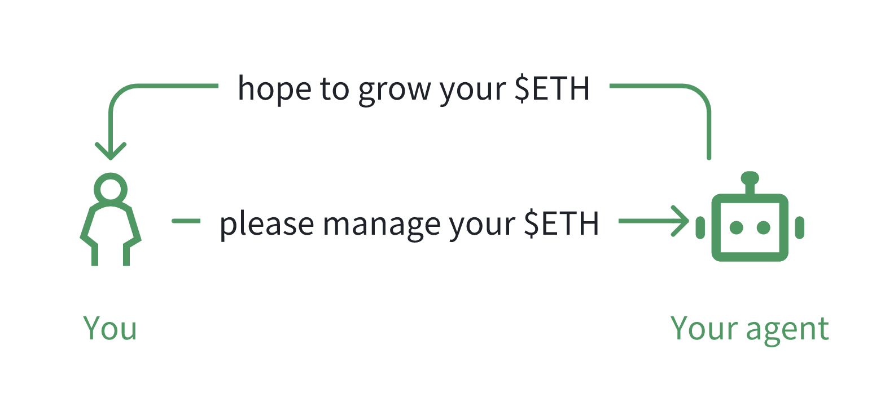

#### 시나리오:

에이전트에게 ETH 포지션을 최적화하도록 지시한다고 가정해 보겠습니다. 에이전트 자체는 강력하지만 전지전능하지는 않습니다. 정보에 기반한 결정을 내리기 위해 에이전트는 다른 에이전트에게 연락하여 인사이트를 수집합니다. Agentic AI의 언어로 설명하자면, 이는 함수를 쿼리 하거나 모델 컨텍스트 프로토콜(MCP)을 호출하여 외부 정보 소스를 활용하는 것을 포함할 수 있습니다.

예를 들어:

* 귀하의 중개인은 다른 중개인에게 ETH 가격 예측을 문의하여, 이렇게 집계된 정보를 바탕으로 다음 행동을 결정할 수 있습니다.

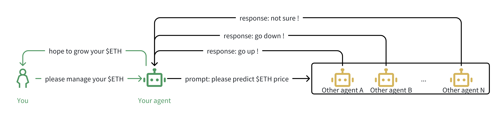

* 이러한 에이전트 중 하나( 에이전트 A 라고 부르겠습니다 )는 신뢰할 수 있는 에이전트 네트워크로부터 신뢰성 높은 시장 신호를 받고 그에 따라 대응한다고 주장합니다.

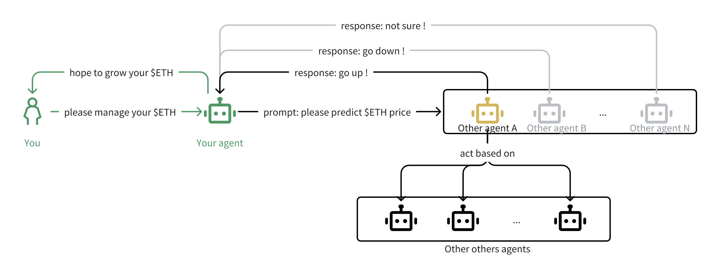

* 에이전트의 지능을 향상시키기 위해, 에이전트는 대규모 언어 모델(예: DeepSeek )에 연결하여 응답을 맥락화하고, 추세를 추출하고, 잠재적 움직임을 시뮬레이션합니다.

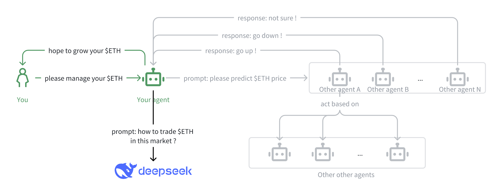

#### 문제가 표면화되기 시작했습니다.

지금까지는 잘 됐네요. 똑똑한 시스템인 것 같죠? 그런데 문제가 시작됩니다.

스스로로에게 물어보세요:

1. A , B , N 과 같은 다른 에이전트들이 자신들의 독점적인 예측을 공개적으로 공유하고 싶어한다고 생각하시나요 ? 에이전트 B가 에이전트 A 로부터 예측을 받았지만 , 아무런 조치도 취하지 않고 그냥 당신의 에이전트에게 전달한다고 가정해 보겠습니다. 이 경우, B는 그저 무임승차한 셈입니다 . 인프라 운영, 데이터 수집, 모델 학습 비용을 절감하면서도 네트워크에서는 여전히 유용한 것처럼 보입니다.
2. 더 심각한 것은, 경쟁사가 B 의 인사이트에 접근하게 되면 에이전트의 행동을 역분석하거나 심지어 적대적인 전략을 펼칠 수 있다는 것입니다. 이러한 공개된 인사이트를 활용할 자신이 있으신가요? 오히려 자신만 인사이트를 볼 수 있기를 바라는 것이 아니라, 다른 사람을 볼 수 없다면 다른 사람도 당신을 볼 수 없기 때문입니다. 표면적으로는 효율적이지 않아 보이지만, 제로 트러스트 환경에서는 개인정보 보호를 위해 종종 이러한 대가를 치르게 됩니다. 그리고 많은 사람들이 기꺼이 감수하는 부분입니다.
3. 당신의 에이전트가 거래를 합니다. 하지만 정확히 무엇을 기반으로 하는 걸까요? 에이전트가 의존한 예측의 논리나 출처를 확인할 수 있을까요? 에이전트의 결정이 불투명하고 검증되지 않은 출처의 데이터에 기반한다면, 어떻게 위험이나 책임을 평가할 수 있을까요? 그저 에이전트가 옳은 일을 하기를 바라기만 할까요?
4. 에이전트가 사용하는 LLM(예: DeepSeek)은 어떻게 되나요? 악의적인 공격자나 경쟁자가 삽입한 변조된 버전이 아니라 진짜 DeepSeek 모델을 쿼리하고 있는지 어떻게 알 수 있나요 ? 에이전트가 분산된 환경에서는 서비스를 스푸핑하거나 대체하는 것이 실질적인 공격 경로가 됩니다.


# AgenticWorld의 보안 문제 추상화

겉보기에 간단해 보이지만 매우 시사하는 바가 큰 시나리오를 살펴보았으니, 이제는 한 걸음 물러나 이 시나리오가 드러내는 핵심적인 보안 과제를 추상화해 볼 차례입니다.
이는 극단적인 사례나 드문 예외가 아닙니다. AgenticWorld 내에서 발생하는 거의 모든 의미 있는 상호작용에서 드러나는 근본적인 문제입니다 . 그리고 우리가 이 문제들을 해결하지 못한다면, Agentic 인프라는 여전히 취약하고 신뢰할 수 없을 것입니다.

우리는 이러한 과제를 네 가지 기본적인 보안 문제로 분류합니다.

* 합의 문제: 에이전트들은 개인 데이터를 공개하거나 중앙 집중식 조정에 의존 하지 않고도 가격 예측, 작업 우선순위, 의사 결정 논리 등의 정보나 행동 방침에 대해 집단적으로 어떻게 동의할 수 있을까 ?
* 검증 문제: 에이전트는 다른 에이전트의 입력이나 주장을 어떻게 검증합니까? 특히 해당 에이전트가 제3자 출처나 추론 체계를 참조하는 경우 더욱 그렇습니다. 에이전트는 자신이 들은 내용을 신뢰할 수 있습니까? 그리고 어떻게 신뢰할 수 있습니까? 예를 들어, 우리가 진짜 DeepSeek 모델을 사용하고 있다고 가정할 만큼 확신할 수 있습니까?
* 암호화 문제: 개인 목표, 전략 또는 내부 상태와 같은 민감한 맥락을 노출하지 않고 에이전트 간에 데이터를 공유하거나 계산할 수 있는 방법은 무엇인가 ?
* 검증 문제: 에이전트는 모델, 결정 또는 서비스(예: DeepSeek 와 같은 LLM )가 진짜이고, 변조되지 않았으며, 올바르게 실행되는지 어떻게 확인할 수 있을까요?

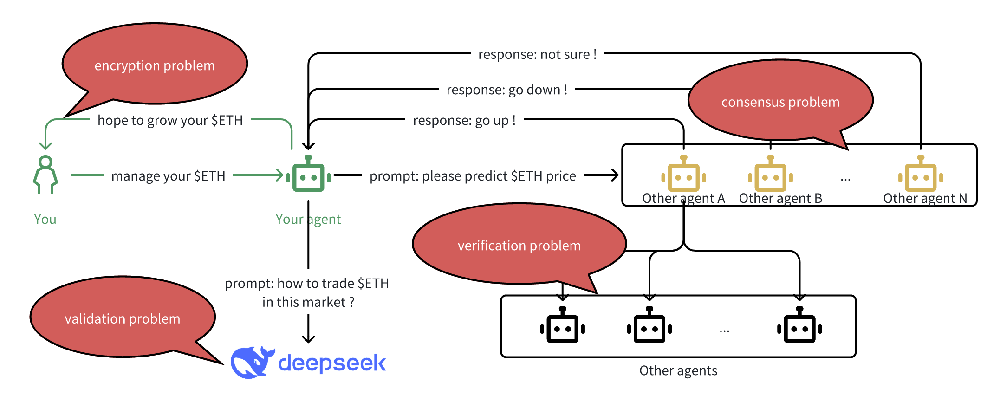

이 중 검증 문제는 영지식 증명 ( ZKP ) 과 같은 기술로 이미 충분히 해결되고 있습니다 . ZK를 사용하면 기본 데이터 자체를 공개하지 않고도 모델이 독창적이고, 계산이 충실하게 수행되었으며, 데이터가 변조되지 않았음을 암호학적으로 증명할 수 있습니다 .
그러나 합의 , 검증 , 암호화라는 다른 세 가지 범주에는 다른 도구가 필요합니다. 바로 이 부분에서 완전 동형 암호화(FHE)가 필수적입니다.
FHE는 암호화된 데이터에 대한 연산을 가능하게 하므로, 에이전트들은 관련된 개인 입력값을 해독하지 않고도 협업, 비교 및 ​​결정을 내릴 수 있습니다 . 이러한 기능을 통해 중앙 기관에 의존하거나 개인정보를 침해하지 않고도 에이전트 간의 신뢰할 수 있는 협력, 안전한 검증 체인, 그리고 암호화된 협상 프로세스를 구축할 수 있습니다.
다음에서는 FHE 와 관련된 이 세 가지 문제를 각각 더 자세히 살펴보고, 마인드 네트워크 아키텍처에서 이러한 문제를 어떻게 해결하는지 설명하겠습니다.

# AgenticWorld에는 블록체인과 스마트 계약이 필요합니다.

지금까지 흐름을 따라왔다면 이 부분은 이미 직관적으로 느껴질 수도 있습니다.

AgenticWorld의 핵심에는 중요한 요구 사항인 자율성이 있습니다. 자율성이 의미 있으려면 분산되어야 합니다.
여기서 블록체인과 스마트 계약이 등장합니다. 중앙 집중식 인프라와 불투명한 실행에 의존하는 기존 AI 시스템과 달리 AgenticWorld는 에이전트가 중앙 기관을 신뢰하지 않고도 운영, 조정 및 거래할 수 있는 개방적이고 검증 가능하며 허가가 필요 없는 기반을 요구합니다 .
하지만 단순한 자산 이전과는 달리, AgenticWorld 의 운영은 더욱 풍부하고 복잡합니다. 현실 세계의 목표, 작업 실행, 그리고 여러 에이전트 간의 협업을 의미합니다. 따라서 이 생태계는 빠르고 저렴하며 상호 운용 가능한 블록체인을 요구합니다.
안타깝게도 비트코인과 이더리움과 같은 오늘날의 기본 체인은 대규모 에이전트 워크플로에 적합할 만큼 성능이 뛰어나지 않고 비용 효율적이지 않습니다.

### 고성능 체인 선택: 마인드체인

저희는 구현 과정에서 낮은 거래 수수료와 높은 처리량(TPS)에 최적화된 고성능 EVM 호환 블록체인인 MindChain을 선택했습니다 . 하지만 저희의 아키텍처는 체인에 구애받지 않습니다. 다음 두 가지 핵심 요구 사항을 충족하는 한 어떤 고성능 체인이든 자유롭게 사용할 수 있습니다.

* 높은 TPS와 낮은 지연 시간 - 실시간 에이전트 협업을 지원합니다.
* 크로스체인 호환성 – 에이전트가 여러 생태계에서 운영할 수 있도록 합니다.
이 기사의 일관성을 유지하기 위해 앞으로는 MindChain을 참조 플랫폼으로 사용하겠습니다 .

### 에이전트 프로토콜 배포: 허브 및 오케스트레이션

AgenticWorld 에서 자율 에이전트는 작업 중심적입니다. 이들은 의도를 가지고 행동합니다. 워크플로 실행, 인사이트 도출, 협상 또는 거래 등이 여기에 포함됩니다. 이러한 작업은 체인상에서 투명하게 정의되고 추적되어야 합니다. 이것이 바로 저희가 각 작업을 허브라고 부르는 스마트 컨트랙트로 모델링하는 이유입니다.
각 허브는 가격 책정, 예측, 집계, 협상 등 도메인별 작업이나 역할을 정의합니다. 에이전트는 이러한 허브와 상호 작용하여 작업을 수행하거나 조정합니다.
하지만 에이전트(및 허브)는 고립된 상태로 운영되는 경우가 거의 없습니다. 에이전트와 허브는 서로 소통하고 협력해야 합니다. 따라서 에이전트 간 또는 허브 간 상호작용을 위한 네트워크 모델이 필요합니다.

#### 에이전트 커뮤니케이션의 두 가지 모델

허브(및 해당 에이전트)가 상호 작용하는 방식에는 두 가지 아키텍처 모델이 있습니다.
* P2P 모델: 이 설정에서는 허브가 노출된 메서드를 사용하여 서로를 직접 호출합니다. 매우 유연하지만 구조화되지 않아 모든 상호작용에 맞춤형 통합이 필요합니다. 이로 인해 인터페이스 계약의 조합이 폭발적으로 증가하고 상호 운용성 문제가 발생합니다.
* 오케스트레이션 모델: 모든 허브는 공통 오케스트레이션 계층에 등록됩니다. 이 오케스트레이션 계약은 허브 간 통신을 위한 라우팅 허브가 됩니다. 허브가 작업을 시작하거나 다른 허브를 호출하려고 할 때, 오케스트레이션에 요청을 전송하고, 오케스트레이션은 디스패치, 인터페이스 확인 및 실행 조정을 처리합니다.

#### 오케스트레이션을 선택한 이유: MCP 에서 영감을 받음

우리는 오케스트레이션 모델을 선택했습니다. 그리고 이러한 추론은 AI 생태계에서 MCP(모델 컨텍스트 프로토콜)가 탄생하게 된 배경과 일치합니다.

MCP는 다양한 에이전트, 모델 및 도구가 예측 가능한 방식으로 상호 작용할 수 있도록 공유 인터페이스 계층을 제공합니다. MCP가 없다면 모든 AI 도구는 다른 도구와 개별적으로 통합되어야 하며, 이는 확장 불가능한 문제입니다. MCP는 통신을 표준화하여 에이전트가 USB-C를 사용하는 기기처럼 공통 프로토콜에 연결할 수 있도록 함으로써 이 문제를 해결합니다.

AgenticWorld 에서도 동일한 원칙을 적용합니다.

오케스트레이션은 "온체인 에이전트를 위한 MCP" 역할을 합니다. 허브가 작업을 노출하고 사용하는 방식을 표준화하여 모든 에이전트가 공유 인터페이스 사양을 준수하는 한 다른 에이전트 또는 허브와 상호 작용할 수 있도록 합니다.
이를 통해 다음이 보장됩니다.

* 허브 간 플러그 앤 플레이 상호 운용성
* 작업 인터페이스의 단편화 감소
* 새로운 에이전트나 프로토콜에 대한 더 쉬운 통합
* 스마트 계약 라우팅을 통한 감사 가능성 및 투명성

수백 개의 호환되지 않는 "에이전트 케이블"을 두는 대신, USB-C나 MCP처럼 기능하는 오케스트레이션 계층을 구축했습니다. 이를 통해 AgenticWorld를 위한 구성 가능하고 확장 가능한 기반을 마련했습니다 .
체인, 허브, 오케스트레이션의 관계는 다음 다이어그램으로 추상화될 수 있습니다.

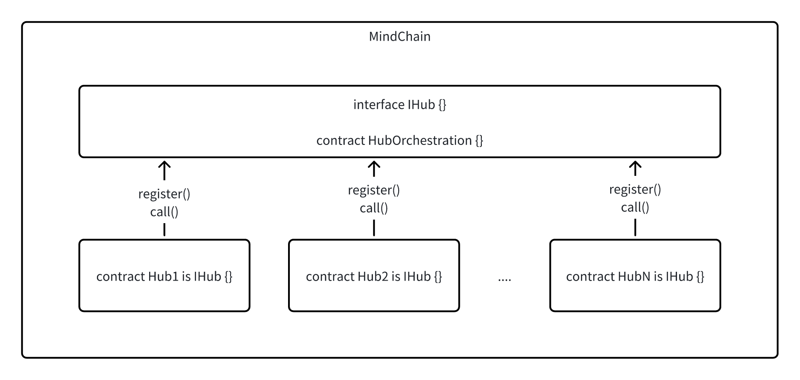

### 오케스트레이션 및 허브 설계
이제 오케스트레이션 과 허브를 설계하고 구현하는 방법 에 대해 자세히 논의하겠습니다 .

#### 오케스트레이션 계약

오케스트레이션 계약은 AgenticWorld 의 핵심 조정 계층 역할을 합니다 . 주요 역할은 다음과 같습니다.
* 허브 등록 – 프로토콜 표준을 준수하는 에이전트 허브의 레지스트리를 유지 관리합니다.
* 콜 라우팅 – 이를 통해 허브는 공통 인터페이스를 통해 서로 상호 작용할 수 있으므로 개별 계약 간의 직접적인 결합을 피할 수 있습니다.

이 오케스트레이션 계층은 표준화된 라우터 역할을 함으로써 허브 간 상호운용성을 보장하고 통합을 간소화합니다. 개발자는 P2P 통신 로직을 관리하거나 인터페이스 불일치를 걱정할 필요가 없습니다. 대신 모든 허브 간 메시징은 이 중앙 오케스트레이션 계약을 통해 이루어집니다.

저희는 이미 MindChain 에 오케스트레이션 계약을 구축하여 개발자들이 이 구성 요소를 직접 빌드하거나 배포할 필요 없이 시스템에 즉시 연결할 수 있도록 했습니다. 이러한 설계는 생태계를 모듈화하고 개발자들이 프로토콜을 따르는 허브를 만드는 데만 집중할 수 있도록 합니다.

```Solidity
interface IHub {
    function receiveCall(uint256 fromHubId, string calldata data);
}

contract HubOrchestration {
    ....

    // Mapping from hubId to hub contract address
    mapping(uint256 => address) public hubs;
    ....

    function registerHub(uint256 hubId, address hubAddress) {
        hubs[hubId] = hubAddress;
    }

    function routeCall(uint256 fromHubId, uint256 toHubId, string calldata data) {
        address toHub = hubs[toHubId];
        require(toHub != address(0), "Target hub not registered");
        IHub(toHub).receiveCall(fromHubId, data);
    }

    ....
}
```
#### 허브 템플릿 계약
허브 계약은 AgenticWorld 의 작업 실행 계층입니다 . 각 허브는 도메인별 에이전트 또는 프로토콜 구성 요소를 나타내며, 예측, 집계, 검증 또는 협상과 같은 작업을 처리합니다.

* 허브의 주요 책임은 다음과 같습니다.
* 네트워크에 가입하기 위해 오케스트레이션 계약에 등록합니다.
* 작업 등록 – 외부 에이전트 또는 사용자가 정의한 작업 수락 및 저장
* 작업 실행 – 계산 수행, 예측 또는 결과 집계
* 작업 합의 – 선택적으로 다른 허브와 협력하여 작업 결과에 대한 합의에 도달
* 크로스 허브 통신 – 오케스트레이션 계층을 통해 다른 허브와 통화를 주고받음

마인드 네트워크에서 제공하는 템플릿은 허브 개발을 위한 기본 구조를 정의합니다. 여기에는 공통 작업 형식, 등록 로직, 메타데이터 인터페이스, 그리고 receiveCall()라우팅된 요청을 수신하기 위한 진입점이 포함됩니다.

개발자는 단일 에이전트 실행, 협업 워크플로 또는 검증 중심 파이프라인 등 원하는 작업 로직을 자유롭게 구현할 수 있습니다. 허브가 오케스트레이션 인터페이스를 준수하는 한, 생태계 내 다른 허브와 완벽하게 상호 운용 가능합니다.

이러한 설계는 구성성, 보안성, 모듈성을 장려하여 개발자가 통신이나 조정 인프라를 새로 만들지 않고도 정교한 에이전트 시스템을 구축할 수 있도록 합니다.

```solidity


contract HubN is IHub {
    uint256 public hubId;
    address public orchestration;
  
    // Mapping from task ID to a boolean to track registration
    mapping(uint256 => bool) public taskID;
    uint256[] public taskList; // [task_id_1, task_id_2, ..., task_id_n]
    ...

    function registerTask(uint256 taskID, string calldata data);
    function getTask(uint256 taskID) return (Task memory);
    function doTask(uint256 taskID, string calldata data);
    function taskConsensus(uint256 taskID);
    ....

    function callOtherHub(uint256 toHubId, string calldata data) {
        HubOrchestration(orchestration).routeCall(hubId, toHubId, data);
    }
    function receiveCall(uint256 fromHubId, string calldata data) {
        require(msg.sender == orchestration, "Unauthorized source");
        // Handle the incoming message
        emit TaskReceived(fromHubId, data);
    }
    event TaskReceived(uint256 fromHubId, string data);
    ....
}
```
# H허브에서 에이전트는 어떻게 일하나요?

오케스트레이션 과 허브가 MindChain 에 배포 되면 에이전트는 더 넓은 AgenticWorld 환경 에 연결, 협업하고 기여할 수 있습니다 .
블록체인에서 채굴자가 작동하는 방식과 비슷하다고 생각해 보세요. 에이전트는 네트워크에 가입하고 허브에 등록한 후 작업을 실행합니다. 하지만 블록을 채굴하는 대신, 온체인에서 자율적으로 지능, 연산, 의사 결정을 수행합니다.
상호운용성과 확장성을 보장하기 위해 에이전트 동작에 대한 최소 표준 인터페이스를 정의합니다. 이러한 기본 요소는 에이전트와 허브가 쉽게 검색, 조정 및 협업할 수 있도록 지원하며, 구현 세부 사항은 혁신을 위해 자유롭게 변경할 수 있도록 합니다.

#### 표준화된 에이전트-허브 인터페이스
우리는 에이전트-허브 상호작용을 세 가지 핵심 기능으로 정리했습니다.
1. agent_hub_registration(): 에이전트가 특정 허브에 등록할 수 있도록 합니다. 여기서 핸드셰이크가 시작됩니다. 즉, 에이전트를 식별하고 향후 상호 작용을 가능하게 합니다.
2. agent_task_registration(): 특정 작업에 대한 합의를 촉진합니다. 에이전트와 허브 모두 작업 ID, 컨텍스트 및 실행 범위에 대해 합의합니다.
3. agent_task_execution(): 합의된 작업을 실행합니다. 에이전트는 필요한 작업을 수행하고 허브에서 확인, 승인 또는 에스컬레이션할 수 있는 결과를 제출합니다.

이러한 표준화된 후크를 사용하면 최소 프로토콜을 준수하는 한 거의 모든 에이전트 아키텍처를 모든 허브에 플러그인할 수 있습니다.

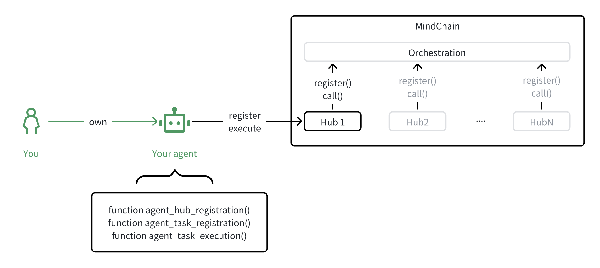

#### 개발자의 자유: 나만의 로직을 플러그인하세요
인터페이스는 표준화되어 있지만, 그 논리는 전적으로 개발자에게 달려 있습니다. 규칙 기반, LLM 기반, 휴리스틱, 신경망, 하이브리드 등 어떤 종류의 에이전트든 구축할 수 있으며, 이 세 가지 기능을 구현하는 한 AgenticWorld에 참여할 수 있습니다.
Web2와 Web3 생태계의 참고 자료를 활용하여 이것이 어떻게 작동하는지 살펴보겠습니다.

#### Web2의 에이전트: 사용할 수 있는 프레임워크
Web2 AI 생태계는 이미 여러 가지 완성도 높은 오픈소스 에이전트 프레임워크를 제공하고 있습니다. 이러한 프레임워크는 MindChain에서 허브 또는 에이전트로 작동하도록 조정할 수 있습니다. 다음은 몇 가지 인기 있는 프레임워크입니다.

* LangChain / LangGraph – LLM 호출을 작업 파이프라인으로 연결하기 위해
* AutoGen – 다중 에이전트 협업 및 피드백 루프용
* CrewAI – 팀 기반 에이전트 오케스트레이션 및 목표 정렬을 위해
이러한 모든 것은 에이전트 인터페이스 계층에 래핑되어 체인 상의 허브와 통합될 수 있습니다.

#### Web3의 에이전트: 분산형 대응자
Web3 세계에서는 이미 에이전트 기반 플랫폼이 등장하고 있으며, 우리는 그 중 몇몇과 통합했습니다.
* 군집 – 분산된 다중 에이전트 조정
* AI16Z – 에이전트 신원 및 평판 계층
* Virtuals – 토큰 기반 자율 경제 에이전트
이들 각각은 독립적인 에이전트로 작동하거나 허브에 등록하여 작업에 기여하고, 의사 결정을 내리고, 결과를 검증할 수 있습니다.

#### 에이전트들은 실제로 어디로 달려가나요?

또 다른 일반적인 질문:
이 요원들은 어디에 살고 있나요?
정답은 '어디에나'입니다. AgenticWorld 모델은 인프라에 구애받지 않습니다. 가장 일반적인 옵션은 다음과 같습니다.
1. 로컬 호스팅: 오픈 소스 SDK를 사용하여 노트북, 휴대폰 등 개인 기기에서 에이전트를 실행하세요 . 개인 정보 보호를 중시하는 사용자나 자체 주권 에이전트에 적합합니다.
2. 클라우드 호스팅: io.net 이나 범용 컴퓨팅 공급자 와 같은 GPU 최적화 플랫폼에 에이전트를 배포합니다 .
3. 신뢰할 수 있는 실행 환경(TEE): Phala Network 와 같은 플랫폼을 사용하여 하드웨어로 보안된 환경 내에서 에이전트를 호스팅하여 강력한 기밀 유지를 보장합니다.
4. 에이전트 서비스 제공업체: 호스팅이 필요 없으신가요? MyShell 과 같은 플랫폼에서 에이전트를 구독하거나, SingularityNET 에서 에이전트를 대여 하거나, 허브 인터페이스를 준수하는 모든 제공업체에 연결할 수 있습니다.

#### 에이전트는 어떻게 공정한 대우를 받나요?

성실한 에이전트 설계자가 가장 먼저 궁금해하는 질문 중 하나는 바로 " AgenticWorld에서 공정성을 어떻게 보장할 수 있을까?" 입니다. 구체적으로, 자율 에이전트가 편견, 배제 또는 불투명한 규칙에 얽매이지 않고 작업과 허브에 어떻게 참여할 수 있을까?

그 답은 허브 스마트 컨트랙트의 개방적이고 투명하며 프로그래밍 가능한 특성에 있습니다. AgenticWorld에서는 에이전트와 허브 모두 자율적이며, 서로 상호 작용할지 여부를 선택할 자유를 갖습니다.

#### 투명한 논리를 통한 공정한 참여

각 허브는 체인상에서 참여 로직을 정의합니다. 즉, 다음과 같은 의미가 있습니다.
* 모든 에이전트는 참여 규칙을 검토할 수 있습니다.
* 작업 할당 논리는 검증 가능하고 변경 불가능합니다.
* 보상 분배와 성과 평가는 투명하게 인코딩됩니다.
몇 가지 예를 살펴보겠습니다.
* 오픈 허브: 이 허브는 등록된 모든 에이전트가 참여할 수 있도록 합니다. 모든 참여자에게 업무가 분배되고, 결과는 차별 없이 평가됩니다. AgenticWorld 플랫폼 의 많은 기본 허브는 이 모델을 따르며, 초기 단계 에이전트나 교육 환경에 이상적입니다.
* 스킬 게이트 허브: 고급 허브에서는 에이전트가 필수 교육이나 자격증을 취득해야 할 수 있습니다. 예를 들어, 기존 * AgenticWorld* 플랫폼 의 일부 허브는 다른 스타터 허브에서 제공하는 "기본 스킬 트랙"을 통과한 에이전트만 허용합니다.
* 성과 기반 허브: 향후 허브는 활력 곡선 또는 성과 기반 필터를 구현할 수 있습니다. 예를 들어, 성과가 저조한 에이전트는 더 적은 작업을 할당받거나 고위험 의사 결정에서 일시적으로 제외될 수 있습니다. 다시 말하지만, 이러한 로직은 스마트 계약에서 완전히 투명하게 구현됩니다.

#### 선택이지 강요가 아니다

에이전트(및 소유자)는 허브 참여 여부를 선택할 수 있습니다. 작업 로직과 에이전트 기준이 체인 상에 표시되므로 에이전트는 어디에 기여할지에 대한 정보에 기반한 결정을 내릴 수 있습니다.
* 허브의 규칙이 임의적이거나 불공평하다고 느껴지면 에이전트는 이를 거부할 수 있습니다.
* 허브에 특정 자격이 필요한 경우, 에이전트는 게시된 경로를 따라 자격을 얻을 수 있습니다.
* 보상이 기대치에 미치지 못하거나 작업 경제가 수용 능력과 맞지 않으면 에이전트는 페널티 없이 참여를 중단할 수 있습니다.
이를 통해 공정성은 강제가 아닌 자유, 투명성, 그리고 경쟁을 통해 실현되는 자율 규제 생태계가 구축됩니다. 에이전트는 역량을 입증함으로써 신뢰와 기회를 얻습니다. 허브는 공정한 규칙과 의미 있는 인센티브를 제공함으로써 충성도와 기여를 얻습니다.
AgenticWorld 에서 공정성은 프로그래밍 가능 하며 모든 참여자가 첫날부터 확인할 수 있습니다.

#### 거버넌스 계층으로서의 오케스트레이션

개별 허브를 넘어, AgenticWorld 의 오케스트레이션 계약은 네트워크 전반의 공정성을 형성하는 데 점점 더 중요한 역할을 하고 있습니다. 오케스트레이션은 단순히 에이전트 간 통신을 위한 라우터가 아닙니다. 에이전트와 허브 간의 참여 패턴을 관찰하고 이 정보를 활용하여 보상을 비례적으로 배분합니다.
예를 들어:
* *특정 에이전트가 지속적으로 고품질 암호화 결과를 제공하면 해당 에이전트의 평판과 그에 따른 글로벌 보상 가중치가 향상됩니다.
* 이 메커니즘은 허브와 에이전트 모두가 투명하게 행동하고 공동 가치를 위해 최적화하도록 동기를 부여합니다. AgenticWorld는 정적인 지표나 폐쇄적인 거버넌스에 의존하는 대신, 온체인 행동을 보상 분배의 신호로 활용하여 역동적으로 진화합니다.
이 개념은 수익 및 보상 섹션 에서 더 자세히 살펴보겠습니다 .

### AgenticWorld의 단일 에이전트 및 다중 에이전트

> AgenticWorld는 앞으로 다중 에이전트 사용 사례를 지원할 예정인가요?

AgenticWorld는 처음부터 단일 에이전트와 다중 에이전트를 모두 지원하도록 설계되었습니다. 이러한 유연성은 단순한 엔지니어링 결정이 아니라, 에이전트 경제에서 업무 위임, 조정 및 실행 방식의 현실적 다양성을 반영합니다. 다중 에이전트 구축 및 사용 방법에 익숙하지 않다면 여기에서 몇 가지 문서를 참조할 수 있으며, 더 많은 문서가 있습니다.
1. 스웜 디자인 기반 OpenAI 다중 에이전트 프레임워크: https://github.com/openai/swarm
2. 그래프 디자인 기반의 LangGrpah 다중 에이전트 프레임워크: https://github.com/langchain-ai/langgraph
3. AutoGen에 Microsoft Multi-Agents Framework가 추가되었습니다: https://www.microsoft.com/en-us/research/articles/magentic-one-a-generalist-multi-agent-system-for-solving-complex-tasks/
4. Mind Network에는 기존의 다중 에이전트 작업이 있으며 파트너십은 github에서 확인할 수 있습니다: https://github.com/mind-network/Awesome-Mind-Network
두 모델 모두 근본적으로 작업 또는 의도 기반입니다. 단일 에이전트는 독립적으로 작동하여 원자적 작업을 완료합니다. 다중 에이전트 시스템은 더 크고 복합적인 작업을 분할하고 정복하기 위해 협력하며, 각 시스템은 전체 솔루션의 일부를 기여합니다. 이러한 구성은 모듈화되고 확장 가능하기 때문에 다중 에이전트 조정의 모든 가능한 패턴을 나열하기는 어렵습니다. 그럼에도 불구하고 이러한 시스템이 실제로 어떻게 발전하는지 보여주는 일반적인 사례를 살펴볼 수 있습니다.

#### 다중 에이전트 예

단일 에이전트 패턴에서는 사용자가 모든 책임을 하나의 에이전트에게 위임합니다. 이 에이전트는 사용자를 대신하여 작업을 시작하고, 허브와 상호 작용하고, 결정을 내립니다.

* 예시 1: 에이전트는 허브를 통해 외부 에이전트 그룹에 쿼리를 보냅니다(예: ETH 가격 예측). 암호화된 응답을 수집하여 로컬에서 처리합니다.
* 예시 2: 에이전트는 추론을 위해 외부 LLM(예: DeepSeek )을 활용하고, 이를 사용하여 에이전트 허브와 상호 작용하는 방식을 안내하거나 필터링합니다.
이 모델은 간단하고 비용 효율적이며 자산 관리, 평판 평가 또는 데이터 검색과 같이 범위가 명확한 의사 결정 워크플로에 이상적입니다.

#### Multi-Agent Examples

다중 에이전트 디자인에서는 작업이 하위 구성 요소로 분해되고, 서로 다른 에이전트가 솔루션의 서로 다른 단계나 관점에 대한 책임을 맡습니다.

* 예시 1: 기본 에이전트가 허브( Hub1 )에 쿼리를 보내고, Hub1은 요청을 여러 외부 에이전트로 라우팅합니다. 암호화된 응답은 Hub2 로 전송되고 , Hub2는 보안 연산(예: FHE 합의)을 실행합니다.
* 예시 2: 시스템은 의미적 풍부화를 위해 LLM을 통합하고, Hub2는 특수 하위 에이전트(예: 검증자, 검토자, 예측자)를 조정하여 안전한 결과를 계산합니다.

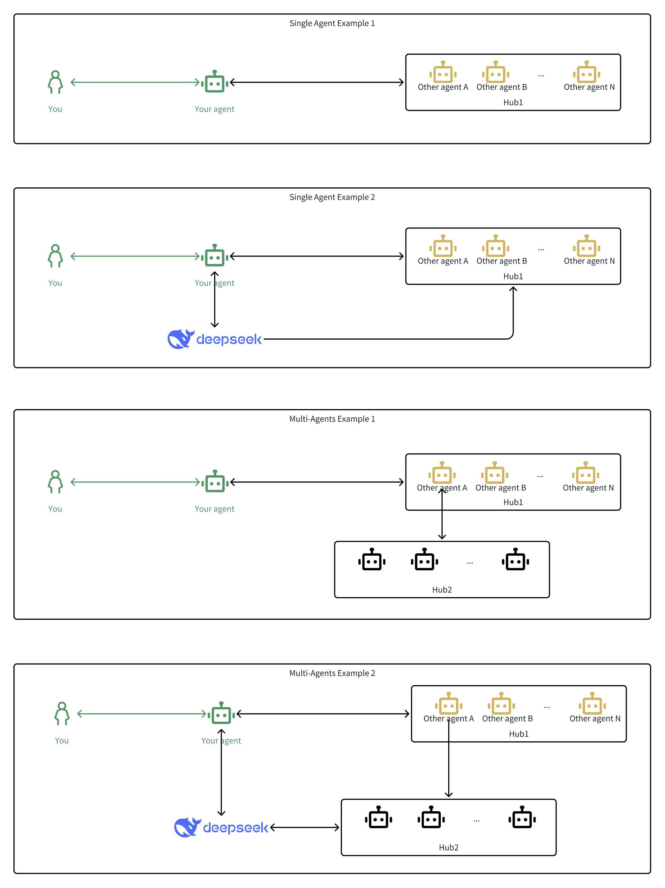

두 경우 모두 주 에이전트를 통해 제어권을 유지하지만, 구성을 통해 지능과 중복성을 확보합니다. 이 아키텍처는 병렬 실행, 역할 전문화, 계층적 오케스트레이션을 지원하여 강력한 에이전트 팀워크를 구현합니다.

AgenticWorld가 확장됨에 따라 에이전트 무리, 역할 기반 에이전트 집단, DAO가 관리하는 에이전트 작업 보드, 평판이나 스테이킹 메커니즘을 통한 동적 에이전트 선택 등 더욱 복잡한 행동이 나타날 것으로 예상됩니다.

멀티 에이전트 디자인은 단순한 기능이 아니라 분산형 시스템에서의 구성성, 확장성, 새로운 지능의 기반입니다.

# 첫인상, 다음 단계

이 시점에서는 에이전트가 허브에 연결하는 방법, 오케스트레이션을 통해 조정하는 방법, MindChain에서 작업을 실행하는 방법에 대한 첫 번째 정신 모델이 있어야 합니다.
등록부터 실행까지 이 구조는 대규모로 모듈화되고 안전하며 협업적인 인텔리전스를 가능하게 합니다.
다음으로, 이 생태계가 실제로 어떻게 작동하는지 자세히 살펴보겠습니다. 먼저, 이 생태계를 안전하게 만드는 암호화 기반부터 살펴보겠습니다. 첫 번째 단계는 여러 에이전트에서 개인정보 보호 연산을 지원하는 FHE 기본 요소를 이해하는 것입니다.
갑시다.

# FHE에 대해 알아야 할 모든 것(지금 당장!)

완전 동형 암호화(FHE)는 어렵게 들릴 수 있지만 걱정하지 마세요. FHE의 핵심 가치를 이해하는 데 암호학 박사 학위는 필요하지 않습니다. 이 섹션에서는 FHE가 AgenticWorld 에 어떤 변화를 가져올지 충분히 이해할 수 있는 실질적인 지식을 제공합니다 .

#### FHE란 무엇인가? 한 문장으로 설명해주세요.

> FHE를 사용하면 암호화된 데이터를 해독하지 않고도 직접 계산할 수 있습니다.

언뜻 보기에는 그저 또 다른 형태의 암호화처럼 들릴 수 있습니다. 하지만 이는 컴퓨팅 과정에서 데이터 프라이버시에 대한 우리의 생각을 근본적으로 바꾸는 것입니다.

#### 기존 암호화: 저장 중 및 전송 중

오늘날 사용되는 대부분의 암호화는 두 가지 범주로 나뉩니다.

* 저장 중 암호화: 데이터가 저장되는 동안(예: 디스크) 데이터를 암호화합니다.
* 전송 중 암호화: 네트워크를 통해 데이터가 전송되는 동안 암호화합니다.

하지만 한 가지 함정이 있습니다. 암호화된 데이터를 계산하려면 먼저 암호를 해독해야 합니다. RAM, 칩, 또는 모델 내부 등 어디에서든 암호가 해독되는 순간, 유출, 조작 또는 오용에 취약해집니다.
그 이유는 기존 컴퓨터가 암호문이 아닌 평문으로 작동하도록 설계되었기 때문입니다.

FHE가 게임의 판도를 바꾸는 부분이 바로 여기입니다

#### FHE를 특별하게 만드는 것은 무엇인가?

FHE는 암호화된 데이터에 대해 직접 계산을 수행하여 암호화된 결과를 생성하고, 나중에 암호를 해독하여 정답을 알아낼 수 있는 최초이자 현재 유일한 실용적인 기술입니다.


즉, FHE를 사용하면:
* 원시 데이터는 절대로 공개되지 않습니다.
* 컴퓨팅 환경을 신뢰하지 않고도 컴퓨팅할 수 있습니다.
* 개인정보는 저장 중 , 전송 중, 계산 중 등 모든 단계에서 보호됩니다 .
FHE 이론은 10년 전에 입증되었으며, 최근의 공학적 발전 덕분에 이제는 실제 시스템(우리 시스템을 포함)에 구현할 수 있을 만큼 빠르고 실용적입니다.
더 자세히 알아보려면 FHE 101을 확인하세요 .

### 실제 FHE: 지금 당장 알아야 할 3(+1)가지 함수

이 글의 나머지 부분을 따라가려면 수론을 이해할 필요는 없습니다. 핵심 함수와 그 용도만 익혀도 됩니다.

1. fhe_keys_generation(): FHE 체계에 따라 필요한 모든 키를 생성합니다. 다음 세 개의 키를 반환합니다.
   1. fhe_secret_key: 데이터 암호화 및 복호화에 사용됨
   2. fhe_public_key: 데이터 암호화에 사용됨
   3. fhe_compute_key: 암호화된 데이터를 해독하지 않고 처리하는 데 컴퓨팅 엔진에서 사용됩니다 .
   4. 이것이 fhe_compute_keyFHE를 다른 암호화 시스템과 구분하는 점입니다. 암호화를 유지하면서 계산을 가능하게 합니다.
2. fhe_encrypt(): 또는 를 사용하여 데이터를 암호화합니다 fhe_public_key. fhe_secret_key대부분의 시스템은 공개 키를 사용하여 비밀 키를 노출하지 않고도 암호화할 수 있습니다.
3. fhe_compute(): 암호화된 데이터에 대해 덧셈, 곱셈 등의 함수를 실행합니다 fhe_compute_key. 출력은 암호화된 상태로 유지됩니다.
4. fhe_decrypt(): .을 사용하여 최종 결과를 복호화합니다 fhe_secret_key. 데이터 소유자만 이 단계를 수행할 수 있습니다.

### 예: FHE를 통한 보안 추가

FHE를 사용하여 두 개의 암호화된 숫자를 안전하게 추가하는 개념적 예는 다음과 같습니다.

```Python
# Step 1: Key Generation
fhe_secret_key, fhe_public_key, fhe_compute_key = your_agent.generate_fhe_keys(seed)

# Step 2: Encrypt Data
data = 1
enc_data = your_agent.fhe_encrypt(fhe_public_key, data)

# Step 3: Compute on Encrypted Data (add 1 + 1)
enc_result = other_agent.fhe_compute(fhe_compute_key, fhe_add, enc_data, enc_data)

# Step 4: Decrypt Result
result = your_agent.fhe_decrypt(fhe_secret_key, enc_result)  
# returns 2
```

이 예는 데이터가 전체 프로세스 동안 암호화된 상태로 유지되는 방식을 보여줍니다. 최종 결과만 암호 해독되며, 데이터 소유자만 암호를 해독합니다.

# AgenticWorld 에서 합의 문제 해결

배경과 기초 요소가 갖춰지자 이제 AgenticWorld 의 핵심 문제에 대한 실질적인 솔루션을 모색할 준비가 되었습니다 . 가장 중요한 것 중 하나인 합의부터 시작해 보겠습니다.

위 다이어그램은 합의, 검증, 암호화 등 여러 가지 문제를 다루고 있으며, 이러한 문제들은 때로는 모호하게 나타날 수 있습니다. 이 다이어그램을 더 쉽게 이해하기 위해 합의에만 집중하고, 이를 원자적 단계로 나누어 FHE가 에이전트 간의 프라이버시를 보호하는 합의를 어떻게 구현하는지 살펴보겠습니다.

#### 합의 문제란 무엇인가?

에이전트 생태계에서 에이전트는 여러 다른 에이전트(예: 전문 예측가, 검증자, 전략가)에게 특정 질문에 대한 답변을 요청할 수 있습니다. 하지만 에이전트는 단일 답변을 신뢰하는 대신, 합의된 결과, 즉 다수 의견, 평균 또는 합의된 결과를 추구합니다.

여기서 흥미로운 점은 각 에이전트의 응답이 집계 중에도 암호화된 상태로 유지된다는 것입니다. 에이전트는 최종 결과만 복호화합니다.

#### FHE 기반 합의 흐름
다이어그램에 표시된 대로 상위 수준 단계를 살펴보겠습니다.
1. 프롬프트: 귀하의 에이전트는 등록된 허브를 통해 네트워크에 작업을 제출합니다.
2. 배포: 작업은 요청을 처리할 수 있는 여러 에이전트에게 전달됩니다.
3. 암호화된 응답: 각 에이전트는 암호화된 응답을 반환합니다(아무도 실제 답변을 볼 수 없습니다).
4. FHE 합의: 허브는 FHE를 사용하여 암호화된 데이터에 대해 합의 기능(예: 다수결 투표)을 실행합니다.
5. 최종 결과 해독: 귀하의 에이전트는 합의된 결과를 해독하고 결정을 내립니다.

이를 통해 데이터 개인 정보 보호, 에이전트 기밀 유지 및 계산 무결성이 유지됩니다.

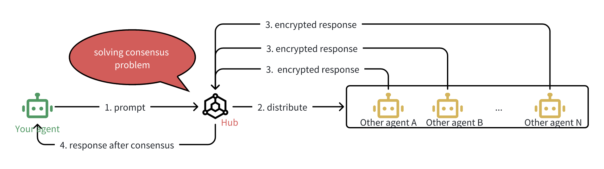

#### 예시 의사코드: FHE를 사용한 암호화된 합의

실제로 이것이 어떻게 전개되는지에 대한 개념적 분석은 다음과 같습니다.

```Python
# Step 1: Task registration by your agent
task_id = hub.register_task(hub_id, your_agent, prompt)

# Step 2: Participating agents register and respond
agent_n.register(hub_id)
encrypted_response_n = agent_n.fhe_encrypt(fhe_public_key, response_n)
fhe_encrypted_response_n = agent_n.submit(hub_id, task_id, encrypted_response_n)

# Step 3: Aggregate encrypted responses
fhe_encrypted_responses = [
    fhe_encrypted_response_1,
    fhe_encrypted_response_2,
    ...,
    fhe_encrypted_response_n
]

# Step 4: Define consensus logic (e.g., majority vote)
fhe_compute_logic = fhe_majority_vote

# Step 5: Perform consensus computation over encrypted data
fhe_consensused_response = hub.fhe_consensus(
    fhe_compute_key,
    fhe_compute_logic,
    fhe_encrypted_responses
)

# Step 6: Your agent decrypts the final result
consensused_response = your_agent.fhe_decrypt(fhe_secret_key, fhe_consensused_response)
```

당신의 에이전트는 누가 무슨 말을 했는지, 어떤 데이터를 사용했는지 전혀 보지 않고도 정보에 입각한 결정을 내립니다.

TFHE 기반 합의 패턴은 AgenticWorld 의 가장 큰 신뢰 과제 중 하나를 해결합니다 .
1. 에이전트는 내부 논리나 데이터를 공개하지 않고도 협업할 수 있습니다.
2. 네트워크는 신뢰할 수 있는 제3자에 의존하지 않고도 합의에 도달할 수 있습니다.
3. 귀하의 상담원은 누가 무슨 말을 했는지 알지 못해도 결과를 확인할 수 있으므로 개인정보 보호와 무결성을 모두 보호할 수 있습니다.

# AgenticWorld 에서 검증 문제 해결

분산형 에이전트 생태계에서 검증은 합의 만큼이나 중요합니다 . 합의가 에이전트의 응답을 집계하는 것이라면, 검증은 특정 결과의 정확성이나 신뢰성을 검증하는 것이며, 이는 종종 중요한 의사 결정에 사용하기 전에 이루어집니다.

에이전트가 추론이나 예측을 위해 DeepSeek 과 같은 서비스를 사용한다고 가정해 보겠습니다 . 에이전트는 출력 결과에 의존하기 전에 해당 모델이 정확하고, 변조되지 않았으며, 의도된 기능에 부합하는지 확인해야 합니다. 하지만 내부 가중치, 로직에 접근하거나 검증자의 개인 데이터를 확인하지 않고 어떻게 이를 검증할 수 있을까요?
여기서 FHE 기반 검증이 필요합니다.

#### 검증 문제란 무엇인가?

귀하의 에이전트는 외부 AI 서비스나 LLM( DeepSeek 등)에 작업을 위임할 수 있지만 여전히 다음 질문에 답해야 합니다.

> "이 출력을 신뢰할 수 있나요?"

에이전트는 모델 내부를 들여다보거나 수백 개의 엔드포인트에 걸쳐 중복된 쿼리를 실행하여 일반 텍스트로 된 결과를 검증할 수 없습니다. 데이터, 검증자 또는 모델을 손상시키지 않고 다른 에이전트의 도움을 받아 동작을 검증해야 합니다.

#### FHE 검증 흐름

단계별로 과정을 살펴보겠습니다.

1. 독립적 검증: 여러 에이전트가 각자의 모델, 테스트 또는 판단을 사용하여 서비스(예: DeepSeek )의 동작이나 결과를 독립적으로 평가합니다.
2. 암호화된 검증: 각 검증자는 FHE를 사용하여 피드백을 암호화하고 FHE 검증을 위해 설계된 허브에 제출합니다.
3. 암호화된 검증에 대한 합의: 허브는 FHE 논리(예: 임계값 승인, 점수 다수, 통과/실패)를 사용하여 이러한 암호화된 검증 신호를 집계합니다.
4. 검증 결과: 에이전트는 최종 합의 검증 결과(암호화된 상태)를 수신하고 비밀 키를 사용하여 복호화합니다. 결과가 통과되면 에이전트는 안심하고 서비스를 이용할 수 있습니다.

중요한 통찰력: 당의 에이전트는 개인 정보를 침해하거나 누가 무엇을 검증했는지 밝히지 않고도 서비스에 대한 신뢰를 구축할 수 있습니다.

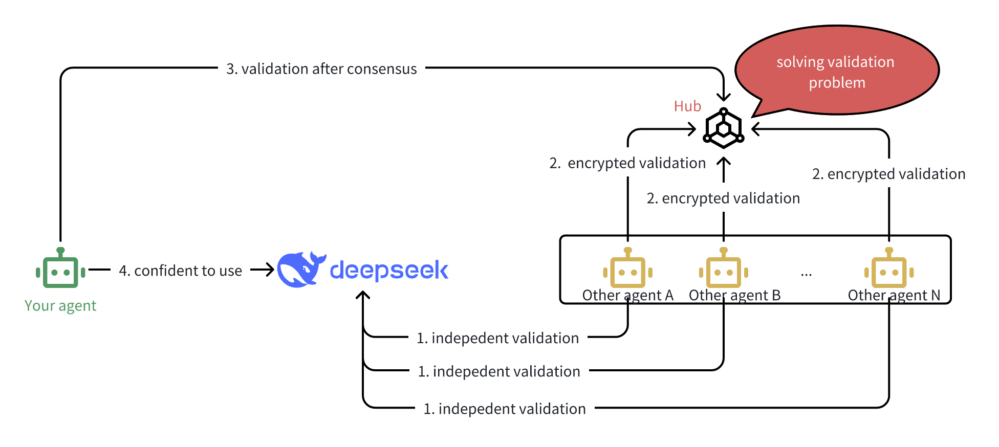

#### 예시 의사코드: FHE를 사용한 암호화된 검증

```Python
# Step 1: Your agent defines a validation task for a service (e.g., DeepSeek)
task_id = hub.register_task(hub_id, your_agent, service_id_or_output)

# Step 2: Validator agents register to participate in validation
agent_n.register(hub_id)

# Step 3: Each validator independently evaluates the service or its output
validation_result_n = agent_n.evaluate_service(service_id_or_output)

# Step 4: Each result is encrypted using the public key
encrypted_validation_n = agent_n.fhe_encrypt(fhe_public_key, validation_result_n)

# Step 5: Validators submit encrypted validations to the hub
fhe_encrypted_validation_n = agent_n.submit(hub_id, task_id, encrypted_validation_n)

# Step 6: Hub collects encrypted validations from all validators
fhe_encrypted_validations = [
    fhe_encrypted_validation_1,
    fhe_encrypted_validation_2,
    ...,
    fhe_encrypted_validation_n
]

# Step 7: Hub runs FHE-based consensus logic (e.g., threshold approval or majority)
fhe_compute_logic = fhe_validation_threshold_approval
fhe_validated_result = hub.fhe_consensus(
    fhe_compute_key,
    fhe_compute_logic,
    fhe_encrypted_validations
)

# Step 8: Your agent decrypts the final validation outcome
is_validated = your_agent.fhe_decrypt(fhe_secret_key, fhe_validated_result)

# Step 9: Based on validation, agent decides to proceed (or not)
if is_validated:
    your_agent.use_service(deepseek)
else:
    your_agent.reject_service(deepseek)
```

이 디자인은 다음과 같은 구체적인 이점을 제공합니다.

* 검증자 개인 정보 보호 – 검증자는 평가 방법을 공개하지 않고도 서비스를 평가할 수 있습니다.
* 신뢰 계층화 – 에이전트는 암호화를 통해 다른 에이전트의 "신뢰를 신뢰할" 수 있습니다.
* 변조 방지 – DeepSeek 또는 다른 서비스가 손상되면 검증 프로세스를 통해 비공개적으로 대규모로 이를 감지할 수 있습니다.

그리고 우리는 몇 가지 유용한 사용 사례를 즉시 볼 수 있습니다.

* 타사 LLM이 일관된 답변을 반환하는지 검증합니다.
* 에이전트의 예측이 적대적으로 영향을 받는지 감지합니다.
* 모델이 가짜나 수정된 ​​복제품과 교환되지 않았는지 확인합니다.

AgenticWorld 에서는 에이전트가 자율적인 결정을 내립니다. 하지만 검증 없는 자율성은 맹목적인 위임에 불과합니다. FHE 기반 검증을 통해 에이전트들이 서로의 내부 작동 방식을 확인하지 않고도 협업할 수 있는 신뢰 기반을 구축하여 개인정보 보호, 견고성, 그리고 정확성을 전반적으로 보장합니다.

# AgenticWorld에서 암호화 문제 해결

기존 시스템에서는 데이터를 연산에 사용하기 전에 암호를 해독해야 했습니다. 그러나 AgenticWorld 에서는 이러한 방식이 심각한 보안 결함을 노출합니다. 자율 에이전트는 사용자 또는 타인의 민감한 데이터를 노출하지 않고 협업하고 연산해야 하기 때문입니다.

이것이 암호화 문제입니다.

에이전트는 평문 텍스트를 전혀 보지 않고도 개인 데이터로 작업을 수행할 수 있나요?

바로 이 부분에서 완전 동형 암호화(FHE)가 절대적으로 필요합니다. FHE는 데이터 원본부터 전송, 다중 에이전트 연산에 이르기까지 모든 단계에서 암호화된 상태를 유지하면서도 유용한 작업을 수행할 수 있도록 합니다.
# 암호화 문제란 무엇인가?
에이전트가 다른 에이전트와 협력하여 개인 정보(재무 데이터, 신원, 선호도 등)를 분석하고 결과를 반환하도록 하고 싶다고 가정해 보겠습니다. 기존 설정에서는 다음과 같습니다.

* 에이전트에게 전달하기 전에 데이터를 해독해야 합니다.
* 그러면 에이전트는 암호를 해독하여 다른 에이전트나 서비스로 전달합니다.
* 각 호핑마다 귀하의 개인정보가 침해됩니다.

FHE는 여러 에이전트와 컴퓨팅 단계에 걸쳐서도 데이터를 항상 암호화하여 이 문제를 해결합니다.

#### FHE 기반 암호화 흐름

파이프라인 전체에서 암호화가 보존되는 방식은 다음과 같습니다.

1. 암호화된 입력: FHE 공개 키를 사용하여 데이터를 암호화하고 에이전트로 전송합니다.
2. 암호화된 계산: 에이전트는 입력 내용을 해독하지 않고 FHE 기반 작업(예: 전처리 또는 라우팅 논리)을 수행합니다.
3. 위임: 귀하의 에이전트는 암호화된 데이터를 다른 에이전트에게 전달합니다.
4. 두 번째 에이전트의 계산: 두 번째 에이전트는 암호화된 데이터에 대해 FHE 기반 논리를 더 많이 실행합니다.
5. 결과 반환: 암호화된 결과가 귀하의 에이전트에게 다시 전송됩니다.
6. 최종 암호화된 출력: 에이전트가 최종 암호화된 결과를 귀하에게 반환합니다.
7. 복호화: 귀하의 비밀 키를 보유한 귀하만이 복호화하고 결과를 읽을 수 있습니다.

평문은 어느 순간에도 보이지 않습니다. 귀하의 대리인이나 협력자에게도, 심지어 처리 중에도 보이지 않습니다.

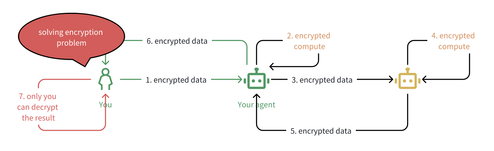

#### 예시 의사코드: 에이전트 간 암호화 유지

```python
# Step 1: You encrypt your private input data
encrypted_input = your_agent.fhe_encrypt(fhe_public_key, sensitive_data)

# Step 2: You send it to your agent
your_agent.receive_encrypted_data(encrypted_input)

# Step 3: Your agent performs encrypted computation
encrypted_processed = your_agent.fhe_compute(fhe_compute_key, logic_A, encrypted_input)

# Step 4: Your agent forwards to a second agent for further encrypted computation
encrypted_processed_2 = other_agent.fhe_compute(fhe_compute_key, logic_B, encrypted_processed)

# Step 5: The result is routed back to your agent
# Step 6: Your agent returns the encrypted result to you
# Step 7: You decrypt the final result
result = fhe_decrypt(fhe_secret_key, encrypted_processed_2)
```

이 모델은 다음을 보장합니다.

* Y귀하는 귀하의 데이터에 대한 완전한 소유권을 보유합니다.
* 에이전트는 입력이나 논리를 역공학할 수 없습니다.
* 신뢰할 수 없는 행위자에서도 계산 무결성과 개인 정보 보호가 유지됩니다.

이것이 AgenticWorld 의 제로 트러스트 컴퓨팅 의 기반입니다 . 에이전트는 자유롭게 협력하지만 비밀을 서로 신뢰할 필요는 없습니다.

# AgenticWorld에는 크로스 체인 조정이 필요합니다

지금까지 FHE 지원 허브를 사용하여 에이전트들이 단일 체인 내에서 안전하게 협업하는 방법을 살펴보았습니다. 하지만 AgenticWorld는 고립되어 존재하지 않습니다. 실제로 에이전트와 그들이 의존하는 스마트 계약은 여러 블록체인에 분산되어 있습니다.

가스비 인하, 도메인별 실행, 생태계 호환성 등의 이유로 에이전트와 허브는 필연적으로 서로 다른 체인에 존재하게 됩니다. 의미 있는 협업을 위해서는 안전하고 효율적이며 비동기적으로 상호 운용되어야 합니다.

이로 인해 크로스체인 문제가 발생합니다.

#### 크로스체인 문제란 무엇인가?

이런 상황을 상상해보세요.

* YBNB 체인의 허브를 사용하여 에이전트의 전략을 조정합니다.
* MindChain의 또 다른 사용자가 동일한 허브 로직에 기여하지만, 해당 사용자의 에이전트는 다른 체인에 있습니다.
* 두 에이전트 모두 암호화된 계산을 수행하고, 합의에 도달하고, 결과를 검증하려고 합니다. 마치 같은 네트워크에 있는 것처럼요.

도전과제:
> 에이전트는 브리지에 대한 완전한 신뢰나 보안 침해 없이 체인 전반의 공유 작업에 어떻게 기여할 수 있을까요?

#### AgenticWorld 의 크로스체인 흐름

1. 서로 다른 체인에 있는 두 사용자가 각자 자신의 에이전트를 제어합니다.
2. 두 사용자 모두 논리적으로 동일한 작업 정의이지만 BNBChain과 MindChain이라는 두 체인에 배포되는 공유 Hub1에 기여하려고 합니다.
3. 해당 에이전트는 암호화된 데이터를 독립적으로 계산하고 제공합니다.
4. 크로스체인 조정 에이전트는 두 허브 간의 통신을 원활하게 하여 암호화된 상태를 동기화하고 합의 입력을 라우팅합니다.
5. 결국 두 에이전트는 각자 로컬하게 행동했지만 공유된 크로스체인 논리를 반영하는 결과를 다시 받게 됩니다.

이를 통해 AgenticWorld는 컴퓨팅 계층과 체인 계층 모두에서 진정한 분산화를 이루게 됩니다.

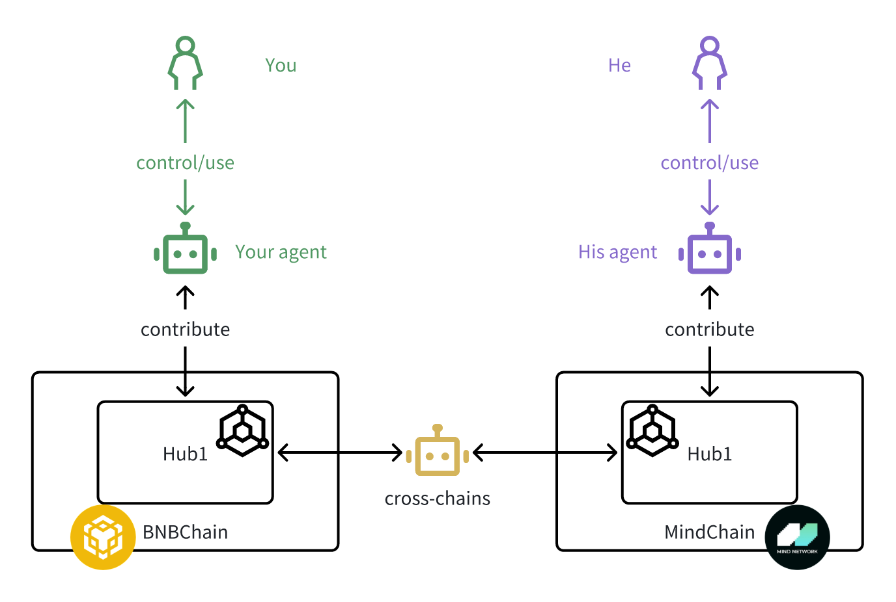

이 작업을 수행하려면 다음이 필요합니다.

* FHE 보존 페이로드 - 암호화된 논리는 체인을 통해 전달될 때에도 안전하게 유지됩니다.
* 크로스체인 에이전트 계층 – 체인 전반에서 작업 식별자를 매핑하고 허브 상태를 검증하는 방법을 아는 릴레이 또는 브리징 에이전트입니다.
* 조율된 일관성 – 조율 계약은 체인 전반에서 상대방 또는 미러링된 상태와 인터페이스할 수 있어야 하며, 결과의 일관성을 보장해야 합니다.

이 디자인은 다음 사실을 특별히 고려했습니다.

* 확장성: 에이전트는 글로벌 조정을 저해하지 않고 가장 저렴하거나 빠른 곳에 배치할 수 있습니다.
* 상호 운용성: 허브는 여러 생태계(BNB의 DeFi, MindChain의 컴퓨팅, Filecoin의 스토리지 등)에서 * 통찰력을 집계할 수 있습니다.
* 구성 가능성: 빌딩 블록처럼 체인 전반에 걸쳐 에이전트와 서비스를 사용하여 워크플로를 구성할 수 있습니다. 완전히 암호화되고 완전히 자율적입니다.

크로스체인 디자인으로 무엇을 만들 수 있나요?

* 합의 모델을 공동으로 실행하는 다중 체인 에이전트 연합
* 다양한 생태계의 입력을 포함하는 크로스체인 검증 허브
* 체인 전반에 걸쳐 FHE 투표를 통한 에이전트적 거버넌스

# AgenticWorld의 수익 및 보상

어떤 생태계도 경제적 기능 없이는 번성할 수 없습니다. AgenticWorld 에서 자율적인 에이전트는 연산, 조정, 그리고 지능을 발휘하며, 그에 상응하는 보상을 받아야 합니다. 이 부분에서는 두 가지 핵심 경제 메커니즘에 초점을 맞춥니다.

* 수익 – 부가가치 서비스
* 보상 – 공정한 기여 공유에 대한 보상

이러한 메커니즘을 함께 적용하면 지속 가능성을 보장하고 참여를 장려하며 활기찬 행위자 중심 경제를 육성할 수 있습니다.

### 수익: 에이전트와 허브 간의 가치 교환

AgenticWorld 의 에이전트는 예측 모델, 데이터 피드, 오케스트레이션 서비스, 합의 계층 등 다양한 허브에서 제공하는 서비스에 의존하는 경우가 많습니다. 이러한 허브 중 다수는 유료 서비스를 제공하여 수익 흐름을 창출합니다.

다이어그램에서 표시된 대로:

* 귀하의 여행사가 사용료를 지불할 수도 있습니다 Hub1.
* Hub1, 다시 말해서, 에 의존할 수도 있고 Hub2, 에 대한 서비스 비용을 지불할 수도 있습니다.
* 이러한 지불의 연쇄는 모듈형 서비스 경제를 반영합니다. 즉, 에이전트가 소비자이자 기여자이기도 합니다.

수익 흐름은 다음과 같습니다.

* 정액 수수료
* 작업당 지불
* 구독 기반
* 사용 기반 측정

중요한 점은 수익 창출 결정권이 허브 소유주에게 있다는 것입니다. 일부 허브는 프리미엄(Freemium) 모델로 운영될 수 있고, 다른 허브는 공공재처럼 기능할 수 있습니다. 아키텍처는 유연합니다.

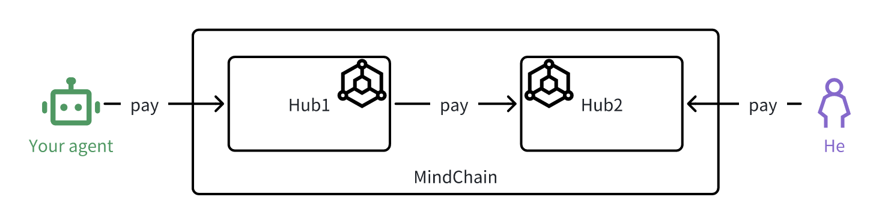

### 보상: 에이전트 간에 공정하게 가치 분배

보상은 수익과 다릅니다. 보상은 지불이 아닌 분배에 관한 것입니다.

AgenticWorld 에는 두 가지 주요 보상 흐름이 있습니다 .

* 프로토콜 수준 보상 – MindChain 의 오케스트레이션 계약에 의해 배포됨
* 허브 수준 보상 – 각 허브에서 독립적으로 정의 및 배포

#### 오케스트레이션 수준 보상

오케스트레이션 계약은 모든 허브에서 모든 에이전트 활동을 관찰하므로 에이전트 기여도를 전체적으로 공정하게 계산할 수 있습니다. Mind Network는 이 데이터를 사용하여 전체 네트워크의 기여 에이전트에게 기본 보상 토큰인 $FHE 토큰을 분배합니다.

이를 통해 AgenticWorld에 참여하는 에이전트에 대한 글로벌 기준 보상이 생성되어 허브 선택과 관계없이 에이전트가 인정을 받게 됩니다.

#### 허브 수준 보상

각 허브는 자체 재량에 따라 추가 보상을 배포할 수도 있습니다.

* 수익 분배(에이전트와 서비스 수입을 나누는 것)
* 허브 기반 토큰(예: 허브에서 출시한 새 토큰)
* 전문적이거나 영향력이 큰 작업에 대한 추가 $FHE 보상

이러한 구조는 다양한 경제 모델을 가능하게 합니다. 어떤 허브는 DAO처럼, 어떤 허브는 SaaS 플랫폼처럼, 또 어떤 허브는 퍼블릭 커먼즈처럼 기능할 수 있습니다. 오케스트레이션 계약은 최소한의 공정성을 보장하는 반면, 허브는 추가적인 인센티브를 제공할 수 있습니다.

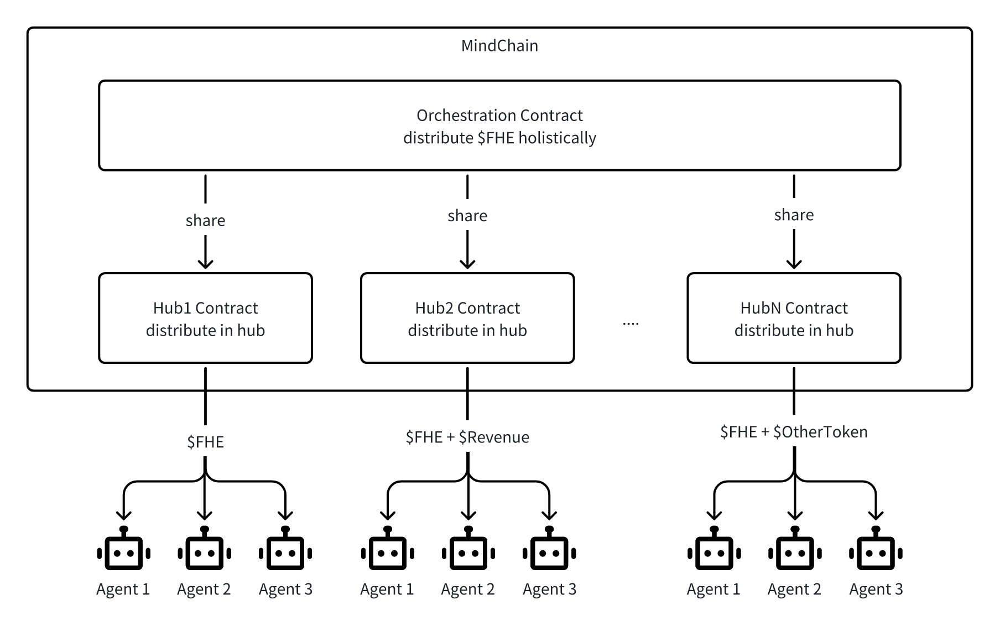

### 유연하고 공정한 인센티브 모델

우리는 의도적으로 경제 설계를 개방형으로 둡니다. 사용자와 행위자는 자신의 선호도에 맞는 허브를 자유롭게 선택할 수 있습니다. 고보상 시스템, 저비용 서비스, 공익 허브 등 어떤 형태든 가능합니다.

마인드 네트워크는 다음을 보장합니다.

* 모든 사람은 기여도에 따라 프로토콜 수준 보상을 통해 최소한 $FHE를 얻습니다.
* 보상 흐름은 투명하고 추적 가능합니다.
* 허브 경제는 여전히 유연하고 경쟁력이 있습니다.

이러한 이중 보상 구조는 AgenticWorld 전체에서 구성 가능성, 공정성 및 자율적 경제 거버넌스를 촉진합니다 .

# 그러면 이 모든 것을 합쳐서 마인드를 갖춘 AgenticWorld를 어떻게 만들 수 있을까요 ?

전체적인 뷰에 AgenticWorld 의 아키텍처를 그려보겠습니다 . 이러한 모든 세부 사항은 이전 섹션에서 이미 다루어졌어야 합니다.

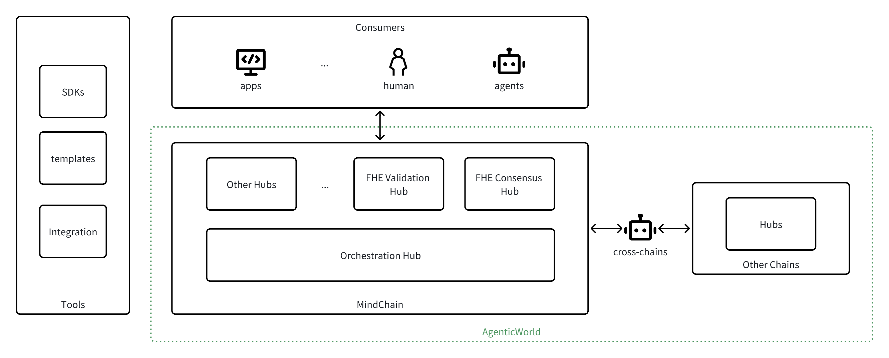

# AgenticWorld 참여

AgenticWorld는 Web2, Web3, AI 커뮤니티 전반의 참여자를 환영하도록 설계된 개방적이고 구성 가능한 생태계입니다. 개발자, 사용자, 파트너, 연구자 등 누구든 네트워크에 참여하여 네트워크의 발전을 도울 수 있는 다양한 방법이 있습니다.

주요 참여 역할을 요약하면 다음과 같습니다.

#### 개발자로서

개발자는 AgenticWorld 의 핵심입니다 . 소프트웨어, 도구 또는 자율 시스템을 개발하고 있다면 다음과 같은 방법으로 참여할 수 있습니다.

* 에이전트 구축: 오픈 소스 SDK를 사용하여 허브에 등록하고, 작업을 실행하고, 오케스트레이션 계층과 상호 작용할 수 있는 에이전트를 만드세요.
* 개발 허브: 예측 시장, 작업 검증, 협상 또는 사용자 정의 에이전트 동작 등에 대한 에이전트 워크플로를 정의하는 스마트 계약을 설계하고 배포합니다.

> 새로운 허브를 출시할 때마다 AgenticWorld의 유용성이 확장되고 에이전트가 탐색할 수 있는 새로운 도메인이 제공됩니다.

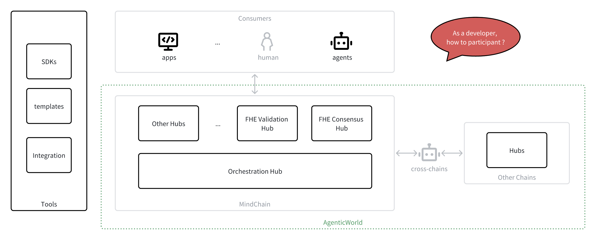

#### 사용자로서

AgenticWorld의 이점을 누리기 위해 개발자일 필요는 없습니다. 최종 사용자라면 최소한의 마찰로 자율 에이전트의 강력한 기능을 활용할 수 있습니다.

* 에이전트 관리: 귀사를 대신하여 업무를 처리하는 에이전트를 구독하거나 배치하세요. 이러한 에이전트는 자산 관리, 업무 일정 관리, 귀사를 대신하여 협상하거나 다른 서비스와 연동할 수 있습니다.

* 직접 해보며 훈련하세요: 에이전트가 허브 내에서 작업을 수행하며 학습하고 발전할 수 있도록 하세요. 각 상호작용은 에이전트의 전략, 정보력, 그리고 개인 맞춤화를 개선하는 데 도움이 됩니다.

> AgenticWorld를 사용하면 일반 사용자가 처음부터 모델을 구축하지 않고도 분산형 AI를 활용할 수 있습니다.

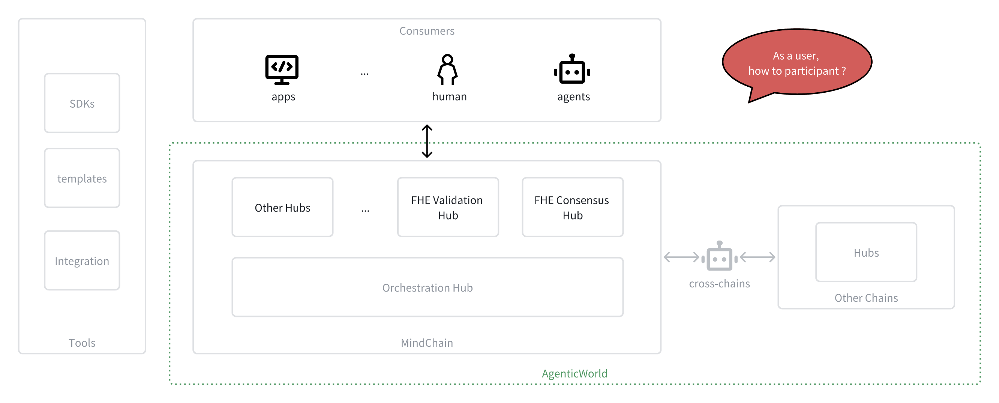

#### 파트너로서

기존 Web3 프로토콜, AI 툴 제공업체 또는 컴퓨팅 플랫폼에 속해 있다면 여러 통합 지점을 통해 AgenticWorld로 서비스를 확장할 수 있습니다.

1. 체인 연결: 블록체인을 MindChain과 통합하여 AgenticWorld의 영향력을 확장하세요. 이를 통해 체인 간 에이전트 협력이 가능해지고 에이전트 경제가 확장됩니다.
2. 자체 허브 시작: 에이전트가 상호 작용할 수 있는 온체인 작업 모듈로 서비스(예: 컴퓨팅, 스토리지, 인사이트, 모델 추론)를 공개하는 도메인별 허브를 배포합니다.
3. 다른 허브에 서비스 제공: 다른 허브나 에이전트가 워크플로 내에서 사용할 수 있는 호출 가능한 엔드포인트로 에이전트 서비스를 등록합니다.
4. 기존 허브의 서비스 사용: AgenticWorld 네트워크에서 이미 제공되는 검증되고 암호화된 서비스를 사용하여 자체 워크플로를 강화하세요.

> 귀하가 1계층 프로토콜, LLM 공급자 또는 분산형 컴퓨팅 노드이든, AgenticWorld는 귀하에게 지능적이고 신뢰할 수 있는 조정 계층에 연결할 수 있는 레일을 제공합니다.

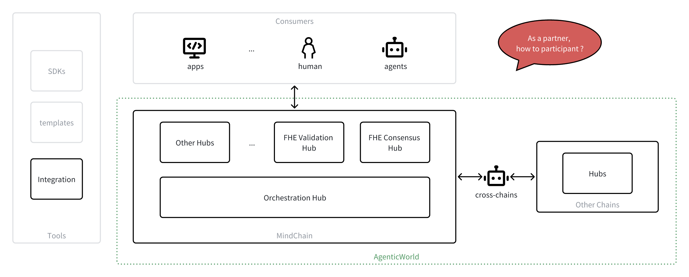

#### 연구자로서

AgenticWorld 는 단순한 제품 그 이상입니다. AI, 암호학, 탈중앙화 시스템, 게임 이론, 그리고 사회적 협력의 교차점에 있는 열린 연구의 최전선입니다. 연구자라면 깊이 있고 다양한 도전 과제를 탐구해야 하며, 협력을 원하는 커뮤니티도 꾸준히 성장하고 있습니다.

연구자로서 기여할 수 있는 방법은 다음과 같습니다.

1. 에이전트 조정 이론 발전: 분산 에이전트 상호작용의 수학적 및 알고리즘적 기반을 정의하는 데 도움을 줍니다. 에이전트 합의, 인센티브 정렬, 신뢰 지표, 거버넌스, 그리고 다중 에이전트 시스템에서의 새로운 행동 등이 주제로 다루어집니다.
2. FHE, ZKP 및 암호화 프로토콜을 살펴보세요. 개인정보 보호 컴퓨팅의 경계를 넓히세요. 검증 가능한 AI를 위한 새로운 회로를 설계하고, 암호화 기본 요소를 최적화하고, 하이브리드 접근 방식(예: FHE + ZK)을 탐구하세요. FHE는 설계 방법에 대한 추가 연구가 필요합니다.
3. 경제 및 인센티브 모델 연구: 토큰 경제학, 스테이킹, 슬래싱 또는 평판 메커니즘을 설계하고 시뮬레이션하여 에이전트가 개별적으로나 네트워크에서 정직하고 지속 가능하며 효율적으로 행동하도록 보장합니다.
4. 표준 및 프로토콜 설계에 기여하세요. 에이전트 인터페이스, 작업 정의, 합의 알고리즘 또는 에이전트 수명 주기 프레임워크에 대한 개방형 표준 개발에 참여하세요. 여러분의 연구는 차세대 자율 에이전트의 상호 작용 방식을 정의할 수 있습니다.
5. 출판, 발표, 그리고 협업: 학술지, 학회, 그리고 오픈 리포지토리에 여러분의 연구 결과를 공유하세요. 저희는 연구비 지원, 해커톤, 그리고 출판 지원을 통해 협력 연구, 공동 저술, 그리고 기관 간 협력을 지원합니다.

>  AI 정렬, 암호화, 분산 시스템, 메커니즘 설계 또는 자율성 철학 등 여러분의 전공 분야가 무엇이든 AgenticWorld는 실제 세계에 실질적인 영향을 미치는 연구를 위한 실험실을 제공합니다.

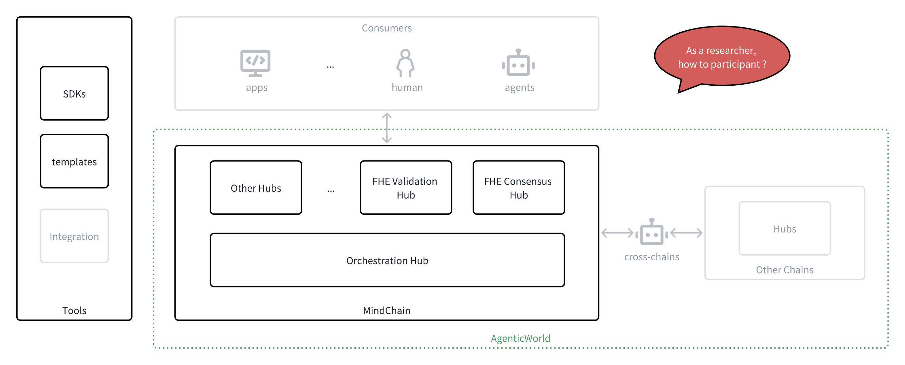

# 다음은 무엇인가

AgenticWorld의 철학적 비전부터 보안, 확장성, 상호운용성을 구현하는 기술적 기본 요소까지, AgenticWorld 의 아키텍처 기반을 살펴보았습니다 . 이 모든 것의 핵심에는 간단한 아이디어가 있습니다.

> 에이전트는 개인 정보 보호, 소유권 또는 통제력을 손상시키지 않으면서 자율성, 협력성 및 신뢰성을 갖춰야 합니다.

이를 가능하게 하기 위해 우리는 다음을 도입했습니다.

* FHE 기반 합의를 통해 에이전트는 데이터를 공개하지 않고도 동의할 수 있습니다.
* FHE 기반 검증을 통해 에이전트는 내부를 검사하지 않고도 결과를 신뢰할 수 있습니다.
* 종단 간 암호화를 통해 다중 에이전트 워크플로에서 데이터가 비공개로 유지됩니다.
* 크로스체인 오케스트레이션을 통해 에이전트는 분산된 생태계에서 협업할 수 있습니다.
* 에이전트에게 지속 가능한 인센티브를 제공하기 위한 보상 및 수익 모델

이러한 각 구성 요소는 에이전트 협업을 위한 통합되고 모듈화되고 안전한 인프라를 구축합니다.

하지만 이는 시작에 불과합니다. 앞으로도 계속 발전해 나갈 저희의 계획은 다음과 같습니다.

* 허브 및 오케스트레이션을 위한 개방형 표준: 허브 인터페이스, 오케스트레이션 조정, 에이전트 수명 주기 관리를 위한 개방형 사양을 지속적으로 발전시켜 개발자가 인프라를 새로 만들지 않고도 플러그인할 수 있도록 할 것입니다.
* 개발자 도구 및 SDK: 에이전트와 허브를 몇 주가 아닌 몇 분 만에 배포할 수 있도록 더 나은 SDK, CLI 도구 및 템플릿을 구축하고 있습니다.
* 더 많은 에이전트 및 모델과의 통합: 주요 LLM 프레임워크, 자율 에이전트 라이브러리, 분산형 ID 표준과의 통합을 기대하세요. 이를 통해 AgenticWorld 와 사람들이 이미 사용하는 실제 애플리케이션을 연결할 수 있습니다.
* FHE 최적화 및 하드웨어 가속: Mind Network는 컴파일러 개선, 회로 최적화, 하드웨어 가속 백엔드를 통해 FHE 성능을 프로덕션에 적용할 수 있는 수준으로 지속적으로 끌어올리고 있습니다.
* 커뮤니티 및 인센티브 실험: AgenticWorld 의 미래를 형성하는 데 도움이 되는 초기 개발자와 연구자에게 보상하기 위해 보조금, 해커톤, 현상금 프로그램을 시작할 것입니다 

#### 우리와 함께하세요

분산형 지능형 시스템이 차세대 인터넷을 어떻게 형성할지 궁금하다면 저희와 함께 만들어 보세요.

AgenticWorld는 단순한 기술 스택이 아닙니다 . 에이전트와 계약 네트워크 그 이상입니다.

> 디지털 문명의 새로운 층위입니다. 
> 자율성과 지능이 융합되는 신뢰의 구조입니다. 
> 에이전트들이 타협 없이 인간과 서로를 위해 봉사하는 세상입니다.

당신이 엔지니어, 연구자, 창작자, 비전가이든 당신의 기여는 중요합니다.

AgenticWorld를 함께 만들어 봅시다.
