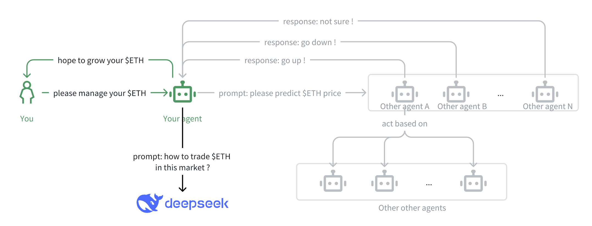
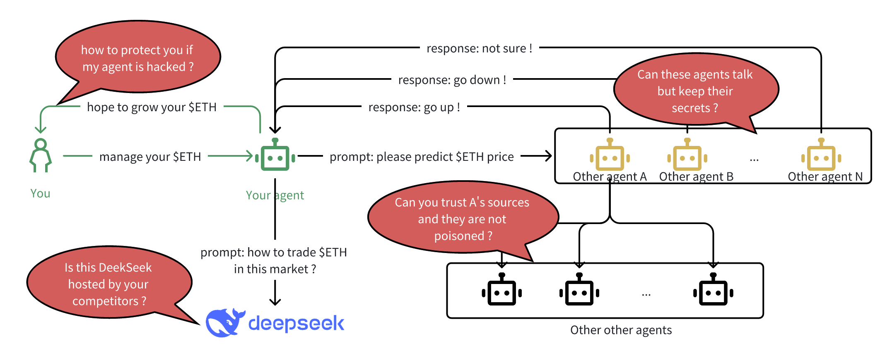
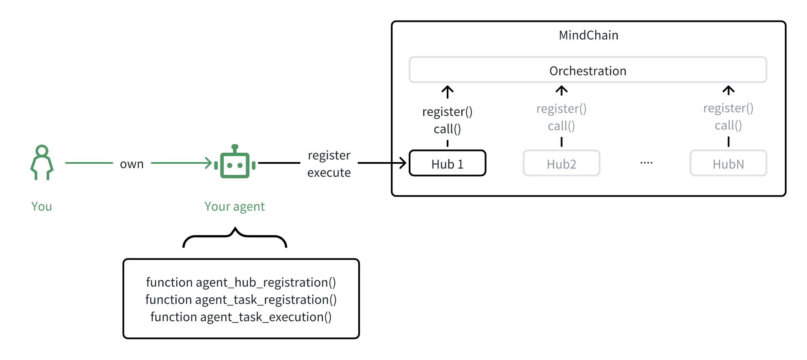
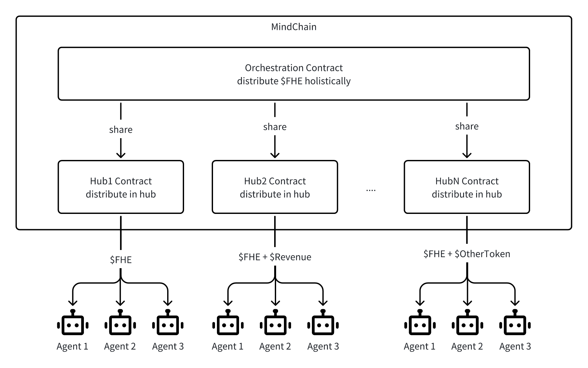

# 用 *Mind* 构建 *AgenticWorld*

> 本项目文档已提供多种语言版本，欢迎通过 Pull Request 改进或新增其他语言版本。

<p align="center">
  🇬🇧 <a href="./README.md"><strong>English</strong></a> | 
  🇰🇷 <a href="./README-KR.md">한국어 (Korean)</a> | 
  🇨🇳 <a href="./README-ZH.md">中文 (Chinese)</a>
</p>

我们将带你逐步了解 *AgenticWorld* 的演进之路，探索 *Mind Network* 的架构是如何从最初的构想发展到如今的形式——以安全性、自主性与可信性为根基，面向 Agentic AI 的未来。

## 构建 *AgenticWorld* 的动机

我们经历了过往几次技术浪潮的洗礼，而今天，我们坚定地相信 Agentic AI 的时代已经到来。除非 *MAGA*（*Microsoft*、*Apple*、*Google*、*Amazon*）都在 AI 上押错了宝，否则可以肯定，在不远的未来，我们每个人都将拥有并委托一位或多位 Agentic AI 来为我们执行任务。这些智能代理将在我们的授权下进行协作——自动化地工作、协商与决策。

那么，这个由 Agentic AI 组成的世界，会是什么样子？是一个 *AgenticWorld* 吗？

“AgenticWorld”这个词并不是我们发明的。在 2024 年的 Microsoft Ignite 大会上，*Satya Nadella* 在其 [主题演讲](https://www.youtube.com/watch?v=3YiB2OvK6sY&t=389s) 中提到：

> “如果你把这些东西组合在一起，你就可以构建一个非常丰富的 *AgenticWorld*。”

如果 *Satya Nadella* 正在为这个未来重塑 *Microsoft*，而 *Sam Altman* 正在构建 [World App](https://www.businessinsider.com/sam-altmans-world-app-store-2025-3) 来让全社会接入这个世界，那么我们每个人都有责任参与这个 *AgenticWorld* 基础设施的建设。

我们关注的，是其中最关键的基石之一：**安全性**。

从 AI 代理到 Agentic AI 的飞跃，核心在于 **自主性** —— 更少的人类干预。但这种自主性也带来了严峻的问题：

- 我们能否信任这些代理在不受他人操控的情况下为我们做决定？
- 我们能否信任它们在交流时不会泄露我们的隐私？

为了构建一个更安全的 *AgenticWorld*，我们需要强有力的 *加密*、*验证* 与 *共识* 机制。经过多年的研究，我们发现 *全同态加密（FHE）* 是最具潜力的解决方案。

*FHE* 并不是一个新鲜技术。它最早可追溯到 1978 年，近年来其生态系统已大幅成熟。在 *Mind Network*，我们过去三年一直专注于构建基于 *FHE* 的区块链应用场景：

- [安全数据湖](https://docs.mindnetwork.xyz/mind-lake-sdk)
- [跨链桥](https://docs.mindnetwork.xyz/minddocs/product/fhe-bridge)
- [隐私投票](https://mindnetwork.medium.com/new-launch-secure-consensus-by-voting-with-fhe-299611f4ff67)

自 2024 年起，我们社区提出了一个新 [问题](https://mindnetwork.medium.com/mind-network-expands-partnership-with-zama-to-launch-pioneering-fhe-ai-network-c21c1a599e15)：

> 为什么不把 FHE 应用在 AI 上？

这个问题开启了我们旅程的新篇章。我们开始尝试 *FHE* 支持的：

- [模型选择](https://mindnetwork.medium.com/mind-network-and-io-net-partners-up-for-advanced-ai-security-and-efficiency-31d8d322658b)
- [预测共识](https://mindnetwork.medium.com/mind-network-and-myshell-partner-to-revolutionize-ai-network-security-with-fhe-based-solution-ed41a8be0f1f)
- [智能体共识](https://mindnetwork.medium.com/deepseek-integrates-mind-networks-fhe-rust-sdk-to-secure-encrypted-ai-consensus-64447ab14612)

这些应用让智能体能够在不暴露内部逻辑、且不泄露隐私的前提下，实现安全且可验证的协同决策。

接下来，我们将探讨 *FHE* 为什么是 *AgenticWorld* 架构中的核心，以及我们是如何设计它，为 Agentic AI 构建一个安全、协作的未来。

## *AgenticWorld* 中一个看似“幼稚”但常见的场景

在深入探讨 *AgenticWorld* 架构之前，我们先来看一个简单但真实的场景。虽然这个例子看起来很“幼稚”，但它却反映了许多我们必须解决的核心挑战，才能让 Agentic AI 安全且高效地运行。

在阅读时，不妨尝试将这个场景映射到你自己生活或工作的某些情境上 —— 你可能会发现比预期中更贴近现实。

### 场景设定：

1. 你是一位用户 —— 更可能是习惯使用链上资产与代理基础设施的 Web3 原住民。
2. 你拥有一些数字资产，例如 ETH（或在 Web2 中的 USD），并拥有或订阅了一位或多位 AI 代理。这些代理会代表你来管理这些资产。
3. 你的目标自然是让 ETH 增值 —— 或至少不要亏损。


### 场景描述：

假设你指示你的代理去优化 ETH 持仓。这个代理虽然能力强大，但并非全知全能。为了做出明智的决策，它需要向其他代理获取洞见。在 Agentic AI 的语言中，这可能涉及调用 [Functions](https://platform.openai.com/docs/guides/function-calling) 或 [Model Context Protocol (MCP)](https://www.anthropic.com/news/model-context-protocol) 来接入外部智能源。

例如：

- 你的代理可能向其他代理请求 ETH 的价格预测，并使用这些汇总的智能信息来决定下一步行动。


- 其中一个代理 —— 我们称之为 *Agent A* —— 声称它从一个值得信赖的智能网络中获取高精度市场信号，并据此作出回应。


- 为了提升洞察力，你的代理还可能接入一个大型语言模型（例如 *DeepSeek*）来分析上下文、提取趋势，或模拟可能的操作路径。



#### 问题开始浮现：

到目前为止，一切看起来都很智能，对吧？但问题也随之而来。

请自问：

1. 你真的认为像 *A*、*B* 或 *N* 这样的代理愿意公开分享它们的专有预测吗？假设代理 *B* 从代理 *A* 接收到一个预测，什么也没做，只是简单地转发给了你的代理。那么，*B* 就是一个*白嫖者*。它避免了运行基础设施、收集数据或训练模型的成本，却依然在网络中显得有用。
2. 更糟的是，如果你的竞争对手获得了 *B* 的洞见，他们可能会反向推理你的代理行为，甚至对你发起对抗性策略。你真的有信心使用这些开放获取的情报吗？其实你真正想要的是：*只有你能看到的洞察*。如果你无法看到他人的，那他人也无法看到你的。从表面上看这似乎效率更低，但在一个零信任的世界中，这往往是我们为隐私付出的代价，而这是许多人愿意接受的权衡。
3. 你的代理做出了一笔交易。但——它是基于什么做出的决定？你能验证它所依赖的预测逻辑或数据来源吗？如果代理的决策基于的是不透明且未验证的信息源，你又如何评估其风险或责任？你只能*希望*它做出了正确的选择？
4. 那么你代理所调用的大模型，比如 *DeepSeek*，你怎么知道它调用的真的是*原版的 DeepSeek 模型*？而不是一个被恶意竞争者或攻击者替换掉的篡改版本？在代理去中心化运行的世界中，伪装或替换服务的攻击向量是切实存在的。



# 抽象化 *AgenticWorld* 中的安全问题

现在我们已经走过一个看似简单、但极具揭示力的场景，是时候退后一步，对其中暴露出的核心安全挑战进行抽象分析了。

这些并不是边缘案例或偶然事件，而是几乎所有 *AgenticWorld* 中有意义交互都会面临的根本性问题。除非我们解决这些问题，否则整个代理基础设施都将是脆弱且不可信的。

我们将这些问题归类为四大基础安全挑战：

- **共识问题（Consensus Problem）**：代理之间如何在*不泄露私密数据*且不依赖中心化协调的前提下，就某个信息或行动达成共识？例如价格预测、任务优先级、或决策逻辑？
- **验证问题（Validation Problem）**：你的代理如何验证其他代理传来的信息或主张，尤其当这些代理还引用了第三方来源或一系列推理链时？它能信任它听到的内容吗？我们真的敢确定我们调用的是正版 *[DeepSeek](https://www.deepseek.com)* 吗？
- **加密问题（Encryption Problem）**：如何在多个代理之间共享数据或进行计算，而又*不暴露*彼此的敏感上下文，例如个人目标、策略或内部状态？
- **可验证性问题（Verification Problem）**：代理如何验证一个模型、决策或服务（比如一个类 *[DeepSeek](https://www.deepseek.com)* 的 LLM）是真实、未被篡改并正确执行的？


其中，**可验证性问题** 已经可以通过 *零知识证明（ZKPs）* 得到良好解决。通过 *ZK*，我们可以加密证明一个模型是原始的，一个计算是忠实执行的，或某段数据未被篡改——而*无需透露底层数据本身*。

但其余三个维度——*共识*、*验证* 和 *加密*，则需要另一个工具。而这，正是 *全同态加密（FHE）* 发挥作用的地方。

*FHE* 允许在加密数据上直接进行计算，也就是说，多个代理可以在*不解密私密输入*的前提下完成协作、比较与决策。这项能力使我们可以在不依赖中心机构、也不泄露隐私的前提下，实现代理之间的信任协同、验证链路和加密协商过程。

接下来，我们将更深入地探讨这三个与 *FHE* 密切相关的问题，并解释我们如何在 *Mind Network* 架构中对它们逐一应对。

# *AgenticWorld* 需要区块链与智能合约

如果你一路读下来，这部分内容或许已经不言自明。

在 *AgenticWorld* 的核心存在一个关键要求：**自主性（Autonomy）**——而真正的自主，必须建立在去中心化之上。

这正是区块链与智能合约的用武之地。与传统 AI 系统依赖中心化基础设施、黑盒执行的方式不同，*AgenticWorld* 需要的是一个开放、可验证、无需许可的底层架构，使代理能够运行、协作和交易，而无需信任任何中心方。

但与简单的资产转账不同，*AgenticWorld* 中的操作更加丰富和复杂——它们代表的是现实世界的目标达成、任务执行、乃至多代理间的协同。因此，这一生态系统需要一条*高速、低成本、强兼容性*的区块链网络。

可惜的是，如今主流的链，比如 Bitcoin 或 Ethereum，在性能和成本方面都不足以支撑大规模的代理工作流。

### 选择高性能公链：*MindChain*

在我们的实现中，我们选择了 [MindChain](https://docs.mindnetwork.xyz/minddocs/product/mindchain) —— 一条高性能、EVM 兼容的区块链，针对低交易费用和高吞吐量（TPS）进行了优化。当然，我们的架构设计是与链无关的。你可以选择任何一条满足以下两个核心要求的高性能链：

* 高 TPS 和低延迟 —— 以支持实时的代理协作。
* 跨链兼容性 —— 使代理能跨生态系统运作。

为了本文叙述的一致性，我们将继续以 *MindChain* 作为参考平台进行说明。

### 部署代理协议：*Hub 与 Orchestration*

在 *AgenticWorld* 中，自治代理是任务驱动的。它们具有明确的意图——执行工作流、获取洞见、协商或交易。这些任务需要在链上被定义和透明追踪，这正是我们将每个任务建模为智能合约的原因，我们称之为 *Hub*。

每个 Hub 定义了一个特定领域的任务或角色：定价、预测、聚合、协商等等。代理通过与这些 Hub 交互以完成或协调工作。

但代理（以及 Hub）很少是孤立运行的，它们必须进行通信与协作。这就带来了构建代理与代理、Hub 与 Hub 交互网络模型的必要性。

#### 代理通信的两种架构模型

Hub（及其代理）之间的交互有两种主要架构模式：

* **点对点模型（Peer-to-peer model）**：在此模型中，Hub 直接通过公开的方法互相调用。这种方式高度灵活，但缺乏结构——每一次交互都需要定制的集成。这会导致接口合约数量呈指数增长，进而引发兼容性问题。
* **编排模型（Orchestration model）**：所有 Hub 都在一个通用的编排层上注册。这个编排合约成为 Hub 间通信的路由中枢。当一个 Hub 想要发起任务或调用另一个 Hub 时，它会将请求发送至 Orchestration，由它负责转发、接口解析和协调执行。

#### 为什么我们选择编排模型：灵感来自 *MCP*

我们最终选择了编排模型，其背后的原因与 AI 生态中 *[MCP (Model Context Protocol)](https://github.com/modelcontext)* 的出现逻辑高度相似。

MCP 为不同的模型、代理和工具之间的交互提供了统一接口。如果没有 MCP，每个 AI 工具都需要逐一集成彼此——这将是不可能维护的混乱局面。MCP 通过标准化通信接口，使代理可以像 USB-C 一样无缝对接通用协议。

在 *AgenticWorld* 中，我们采用了相同的原则：

> 编排层就像“链上代理的 MCP”。它标准化了 Hub 的任务暴露与调用方式，使得任何代理都能与任何其他代理或 Hub 交互——前提是它们遵循共同的接口规范。

这样设计带来了诸多好处：

* Hub 间的即插即用式互操作性
* 减少任务接口碎片化
* 为新代理和协议提供更低的集成门槛
* 所有路由透明可审计，提升安全性

我们不再有上百种不兼容的“代理接口线缆”，而是构建了一个如 USB-C 或 MCP 般通用的编排层，为 *AgenticWorld* 打下了可组合、可扩展的基础。

链、Hub 和编排层的关系可以用下图抽象表示：


### 设计 *Orchestration 与 Hubs*

接下来我们将更详细地讨论如何设计和实现 *Orchestration* 与 *Hub*。

#### Orchestration 合约

*Orchestration 合约* 是 *AgenticWorld* 的核心协调组件。其主要职责包括：

- **Hub 注册**：维护符合协议标准的代理 Hub 注册表  
- **调用路由**：使 Hub 之间能通过统一接口进行交互，避免直接耦合每个合约

通过标准化的路由逻辑，该编排层确保了 Hub 之间的互操作性，并简化了系统集成。开发者无需自行编写点对点通信逻辑，也无需担心接口不匹配的问题。所有跨 Hub 消息交互都通过中心编排合约完成。

我们已经在 [MindChain](https://docs.mindnetwork.xyz/minddocs/product/mindchain) 上部署了该编排合约，因此开发者可以立即接入，无需自行构建这一部分，从而专注于构建符合协议的业务 Hub。

```solidity
interface IHub {
    function receiveCall(uint256 fromHubId, string calldata data) external;
}

contract HubOrchestration {
    // Hub ID 映射至其合约地址
    mapping(uint256 => address) public hubs;

    function registerHub(uint256 hubId, address hubAddress) public {
        hubs[hubId] = hubAddress;
    }

    function routeCall(uint256 fromHubId, uint256 toHubId, string calldata data) public {
        address toHub = hubs[toHubId];
        require(toHub != address(0), "Target hub not registered");
        IHub(toHub).receiveCall(fromHubId, data);
    }
}
```

---

### Hub 合约模板

Hub 合约是 *AgenticWorld* 的任务执行层。每个 Hub 代表一个特定领域的代理或协议组件 —— 负责预测、聚合、验证、协商等任务。

一个 Hub 的核心职责包括：

- 向 Orchestration 合约注册自身，加入代理网络  
- **任务注册**：接收外部代理或用户定义的任务并存储  
- **任务执行**：执行计算、生成预测或聚合结果  
- **任务共识**：可选地与其他 Hub 协同达成结果共识  
- **跨 Hub 通信**：通过编排层发送或接收其他 Hub 的调用  

Mind Network 提供的模板定义了 Hub 开发的基础结构，包括通用任务格式、注册逻辑、元信息接口和用于接收路由请求的 `receiveCall()` 入口。

开发者可以自由实现自己的任务逻辑 —— 无论是单代理执行、协作式工作流，还是强调验证的处理链。只要 Hub 遵循编排接口，就能与生态中的其他 Hub 完全互操作。

这种设计鼓励模块化、可组合性和安全性，让开发者能专注于构建复杂的代理系统，而无需重造通信和协调的基础设施。

```solidity
contract HubN is IHub {
    uint256 public hubId;
    address public orchestration;

    // 任务 ID 到布尔值的映射用于跟踪任务注册
    mapping(uint256 => bool) public taskID;
    uint256[] public taskList; // [task_id_1, task_id_2, ..., task_id_n]

    function registerTask(uint256 taskID, string calldata data) external {}
    function getTask(uint256 taskID) external view returns (Task memory) {}
    function doTask(uint256 taskID, string calldata data) external {}
    function taskConsensus(uint256 taskID) external {}

    function callOtherHub(uint256 toHubId, string calldata data) external {
        HubOrchestration(orchestration).routeCall(hubId, toHubId, data);
    }

    function receiveCall(uint256 fromHubId, string calldata data) external {
        require(msg.sender == orchestration, "Unauthorized source");
        // 处理接收到的消息
        emit TaskReceived(fromHubId, data);
    }

    event TaskReceived(uint256 fromHubId, string data);
}
```

---

### 代理在 Hub 中如何工作？

一旦 Orchestration 和 Hubs 在 MindChain 上部署完成，代理就可以开始连接、协作，并为更广泛的 AgenticWorld 世界贡献力量。

你可以把它想象成区块链中的矿工：代理加入网络、注册至某个 Hub，并开始执行任务。但与“挖矿”不同，它们贡献的是智能、计算与决策 —— 并且是链上自治的。

为了确保系统的互操作性和可扩展性，我们定义了一个最小化标准接口，用于描述代理的行为。这些基本函数使得代理和 Hub 可以轻松发现彼此、协调工作 —— 同时也保留了实现层的创新空间。

---

### 标准化的 Agent-Hub 接口

我们将代理与 Hub 的交互抽象为三个核心函数：

1. **agent_hub_registration()**：  
   代理与特定 Hub 建立连接，开始握手流程，标识身份并启用后续交互

2. **agent_task_registration()**：  
   注册具体任务。代理与 Hub 就任务 ID、上下文和执行范围达成一致

3. **agent_task_execution()**：  
   执行已注册任务。代理完成计算并提交结果，由 Hub 验证、接受或上报

这些标准化的接口钩子，使几乎任何代理架构都可以接入任意 Hub —— 只要它符合这一协议。

---


### 开发者的自由：接入你自己的逻辑

虽然接口是标准化的，但实现逻辑完全由开发者决定。你可以构建任何形式的代理 —— 基于规则、基于大模型、启发式、神经网络或混合模型 —— 只要它支持上述三个函数，它就可以参与 AgenticWorld。

---

### Web2 中的代理：可复用的框架

Web2 的 AI 生态已经发展出许多成熟的开源代理框架，它们可以适配为 Hub 或代理并运行在 MindChain 上。以下是一些流行的选择：

- **LangChain / LangGraph**：将 LLM 调用组织为任务流程  
- **AutoGen**：多代理协作与反馈循环框架  
- **CrewAI**：面向团队目标的代理编排系统  

这些框架都可以包裹进代理接口层，然后无缝接入链上 Hub。

---

### Web3 中的代理：去中心化的实现

在 Web3 世界，我们已经看到了一些原生的代理平台，并已与它们完成集成：

- **Swarms**：分布式多代理协调系统  
- **AI16Z**：代理身份与声誉层  
- **Virtuals**：与 Token 绑定的自治经济代理  

它们都可以作为独立代理运行，或注册至 Hub，参与任务执行、决策制定或结果验证。
#### 代理究竟运行在哪里？

一个常见的问题是：

> *“这些代理到底部署在哪里？”*

答案是：**哪里都可以**。AgenticWorld 模型对基础设施是无感知的。以下是几种常见的部署方式：

1. **本地部署**：使用我们的开源 [SDK](https://github.com/mind-network/Awesome-Mind-Network) 在个人设备（笔记本、手机）上运行代理。非常适合注重隐私或追求主权控制的用户。
2. **云部署**：将代理部署在如 [io.net](https://mindnetwork.medium.com/mind-network-and-io-net-partners-up-for-advanced-ai-security-and-efficiency-31d8d322658b) 等 GPU 优化平台，或其他通用计算服务商上。
3. **可信执行环境（TEEs）**：使用如 [Phala Network](https://mindnetwork.medium.com/mind-network-x-phala-network-spore-fun-e47edfb0dcc3) 等平台，在硬件级安全环境中运行代理，确保强机密性。
4. **Agent-as-a-Service 服务商**：不想自己部署？你可以从 [MyShell](https://mindnetwork.medium.com/mind-network-and-myshell-partner-to-revolutionize-ai-network-security-with-fhe-based-solution-ed41a8be0f1f) 等平台订阅代理，或从 [SingularityNET](https://mindnetwork.medium.com/mind-network-x-singularitynet-introducing-asi-hub-a-secure-ai-and-verifiable-randomness-solution-5e51a88c3dd4) 租用代理，或连接任意兼容 Hub 接口的服务商。

---

#### 如何保障代理的公平参与？

一个有责任感的代理设计者可能首先会问：

> *“如何确保 AgenticWorld 是公平的？”*

更具体地说：自主代理如何在不受偏见、歧视或黑箱规则影响的情况下，参与任务与 Hub？

答案就在于 —— **Hub 智能合约的开放、透明和可编程性**。在 AgenticWorld 中，代理和 Hub 都是自主个体，彼此之间的交互基于明确规则和自由意志。

---

#### 通过链上透明逻辑实现公平参与

每个 Hub 的参与逻辑都在链上定义。这意味着：

* 任意代理都可以查看参与规则；
* 任务分配逻辑是可验证的、不可更改的；
* 奖励分配与绩效评估在合约中透明编码。

举几个例子：

* **开放型 Hub**：任何已注册代理都可以参与，任务分发无差别，结果评估无偏见。[*AgenticWorld* 平台](https://agent.mindnetwork.xyz/agenticworld) 上的多数基础 Hub 都是这种类型，适合早期代理或训练阶段。
* **技能门槛型 Hub**：一些高级 Hub 要求代理完成特定培训或认证。例如，平台上的某些 Hub 仅允许通过 “基础技能轨” 的代理进入，该技能轨在其他入门 Hub 中提供。
* **基于绩效的 Hub**：未来的 Hub 可能实施“活力曲线”或绩效筛选机制。表现不佳的代理可能接收更少任务，或被暂时排除在高风险决策之外 —— 但这些规则都在智能合约中完全公开。

---

#### 是选择，而非强制

代理（及其拥有者）**有权选择是否参与某个 Hub**。由于任务逻辑和代理准入条件都是链上可见的，代理可以根据自身意愿做出明智选择：

* 如果某个 Hub 的规则看起来随意或不公平，代理可以选择不参与；
* 如果某 Hub 要求特定资质，代理可以根据公开路径去获取资格；
* 如果奖励机制或任务经济模型不合理，代理可以无惩罚地退出。

这种机制创建了一个自我调节的生态系统 —— **公平不是依靠强制，而是源于自由、透明与竞争**。

代理通过展现能力赢得信任与机会；Hub 通过提供公平规则与合理激励吸引代理参与。

在 *AgenticWorld* 中，**公平是可以编程的** —— 从第一天起即向所有参与者完全公开。

#### 作为治理层的 Orchestration

在 *AgenticWorld* 中，Orchestration 合约除了作为代理间通信的路由器外，还在整个网络的公平性方面扮演着越来越重要的角色。Orchestration 合约不仅仅是代理通信的路由器，它观察代理和 Hub 之间的参与模式，并利用这些信息来按比例分配奖励。

例如：

* 如果某个 Hub 活跃度高，使用频繁，Orchestration 可能会为其分配更高的奖励份额。
* 如果某些代理持续贡献高质量的加密结果，它们的声誉 — 以及全球奖励权重 — 会得到提高。

这一机制鼓励 Hub 和代理都要透明地行为，并优化集体价值。与依赖静态指标或封闭治理的传统方式不同，*AgenticWorld* 通过链上行为作为奖励分配的信号，动态演化。

这一概念将在 *收入与奖励* 部分中进一步探讨。

### 单代理与多代理在 AgenticWorld 中的应用

> *AgenticWorld* 会支持多代理使用场景吗？

从第一天开始，*AgenticWorld* 就设计了支持单代理和多代理的能力。这种灵活性不仅仅是工程决策 — 它反映了任务委派、协调和执行方式的多样性。如果你不太熟悉如何构建和使用多代理系统，可以查看以下文档，并且更多资料在这里：

1. 基于群体设计的 OpenAI 多代理框架：[https://github.com/openai/swarm](https://github.com/openai/swarm)
2. 基于图设计的 LangGraph 多代理框架：[https://github.com/langchain-ai/langgraph](https://github.com/langchain-ai/langgraph)
3. 集成到 AutoGen 中的 Microsoft 多代理框架：[https://www.microsoft.com/en-us/research/articles/magentic-one-a-generalist-multi-agent-system-for-solving-complex-tasks/](https://www.microsoft.com/en-us/research/articles/magentic-one-a-generalist-multi-agent-system-for-solving-complex-tasks/)
4. Mind Network 的多代理工作和合作伙伴可以在其 GitHub 中找到：[https://github.com/mind-network/Awesome-Mind-Network](https://github.com/mind-network/Awesome-Mind-Network)

这两种模型本质上都是任务或意图驱动的。单个代理独立操作来完成原子任务，而多代理系统则通过协作来分解并完成更大、组合性的任务——每个代理都为整体解决方案贡献一部分。由于这些组成是模块化和可扩展的，很难枚举所有可能的多代理协调模式。不过，我们可以通过一些常见的例子来说明这些系统如何在实践中演变。

#### 单代理示例

在单代理模式下，用户将所有责任委托给一个代理。这个代理会启动任务、与 Hub 交互并代表用户做出决策。

* 示例 1：代理通过一个 Hub 查询一组外部代理（例如，预测 ETH 价格）。它收集加密后的响应并在本地处理。
* 示例 2：代理利用外部 LLM（例如 *DeepSeek*）进行推理，然后用于指导或过滤如何与代理 Hub 交互。

这种模型简单、成本效益高，非常适合处理具有明确范围的决策工作流，如资产管理、信誉评分或数据检索。

#### 多代理示例

在多代理设计中，任务被分解为多个子任务，不同的代理负责处理每个阶段或从不同角度解决问题。

* 示例 1：你的主代理查询一个 Hub（*Hub1*），Hub1 将请求路由到多个外部代理。它们的加密响应然后提交给 *Hub2*，由 *Hub2* 运行安全计算（例如，FHE 共识）。
* 示例 2：系统集成了一个 LLM 进行语义增强，同时 *Hub2* 协调专门的子代理（例如验证者、审查者、预测者）来计算安全结果。


在这两种情况下，你依然通过主代理保持控制，但通过组合获得了更多的智能和冗余。该架构支持并行执行、角色专业化和分层编排，从而实现强大的代理团队协作。

随着 *AgenticWorld* 的发展，我们预计将会有更多复杂的行为出现：代理群体、基于角色的代理集体、DAO 管理的代理任务板、通过声誉或质押机制动态选择代理等等。

多代理设计不仅仅是一个功能——它是去中心化系统中组合性、可扩展性和新兴智能的基础。

# 初步印象与后续步骤

到目前为止，你应该已经对代理如何连接到 Hub、如何通过 Orchestration 协调和如何在 MindChain 上执行任务有了初步的认知。

从注册到执行，这一结构实现了可扩展、安全和协作的智能。

接下来，我们将深入探讨这个生态系统如何在实践中工作——首先是了解支撑它的加密基础，确保它的安全性。第一步是什么？了解支撑代理隐私保护计算的 FHE 基础。

让我们开始。

# 关于 FHE 的一切（目前所需了解的）

完全同态加密（FHE）可能听起来令人生畏，但不用担心。你不需要拥有密码学博士学位来理解其核心价值。本节为你提供足够的实践知识，帮助你了解为什么 FHE 对 *AgenticWorld* 至关重要。

#### FHE 是什么？一句话解释：

> **FHE 让你可以直接在加密数据上进行计算——而无需解密它。**

乍一看，这可能看起来只是另一种加密形式。但它在我们思考数据隐私时的计算方式上，产生了根本性的转变。

#### 传统加密：静态与传输中的加密

目前，大多数使用中的加密都可以分为两类：

* 静态加密：加密存储中的数据（例如在硬盘上）。
* 传输中加密：加密在网络中传输的数据。

但是有一个问题：为了在加密数据上进行计算，你必须先解密它。而且一旦数据解密——无论是在 RAM、芯片上还是在模型中——它就容易受到泄漏、篡改或滥用的风险。

这是因为传统计算机是设计来操作明文数据的，而不是密文数据。

这就是 FHE 改变游戏规则的地方。

#### FHE 的特别之处是什么？

FHE 是目前唯一可以实用地直接在加密数据上进行计算的技术，它产生加密结果，这些结果可以在以后解密，从而得到正确的答案。

换句话说，使用 FHE 时：

* 你永远不会暴露原始数据。
* 你可以在不信任计算环境的情况下进行计算。
* 隐私在端到端（*静态*、*传输*和*计算*）过程中得以保护。

FHE 背后的理论早在十多年前就已被证明，且由于近期工程上的突破，它现在足够快速和实用，可以部署在实际系统中——包括我们自己的系统。

如果你想更深入了解，可以查看我们的 [FHE 101](https://docs.mindnetwork.xyz/minddocs/research/fhe-research/fhe-101)。

### FHE 在实践中：你需要了解的 3(+1) 个核心功能（目前为止）

为了理解本文的其余内容，你无需了解数字理论。只需了解以下核心功能及其目的即可。

1. `fhe_keys_generation()`：生成所有 FHE 方案所需的密钥。它返回三个密钥：
   1. `fhe_secret_key`：用于加密和解密数据
   2. `fhe_public_key`：用于加密数据
   3. `fhe_compute_key`：用于计算加密数据的密钥，*无需解密数据*。
   4. 这个 `fhe_compute_key` 区别于其他加密系统——它使得计算可以在保持加密的同时进行。
2. `fhe_encrypt()`：使用 `fhe_public_key` 或 `fhe_secret_key` 加密数据。大多数系统使用公钥加密，这样就能在不暴露私钥的情况下进行加密。
3. `fhe_compute()`：对加密数据执行函数（如加法、乘法等），使用 `fhe_compute_key`。输出依然是加密的。
4. `fhe_decrypt()`：使用 `fhe_secret_key` 解密最终结果。只有数据拥有者才能执行此步骤。

### 示例：使用 FHE 进行安全加法

这是一个概念性的示例，展示如何使用 FHE 来安全地加密两个数字并求和：


```Python
# Step 1: Key Generation
fhe_secret_key, fhe_public_key, fhe_compute_key = your_agent.generate_fhe_keys(seed)

# Step 2: Encrypt Data
data = 1
enc_data = your_agent.fhe_encrypt(fhe_public_key, data)

# Step 3: Compute on Encrypted Data (add 1 + 1)
enc_result = other_agent.fhe_compute(fhe_compute_key, fhe_add, enc_data, enc_data)

# Step 4: Decrypt Result
result = your_agent.fhe_decrypt(fhe_secret_key, enc_result)  
# returns 2
```
这个示例展示了数据在整个过程中始终保持加密状态——只有最终结果会被解密，且只有数据拥有者才能解密。

 *** 
 # 解决 AgenticWorld 中的 共识问题
在建立了背景和基础元素之后，我们现在可以探索 AgenticWorld 中核心问题的实际解决方案——从共识问题开始，这是最关键的问题之一。

上面的图表涉及多个问题（共识、验证和加密），这些问题有时会混淆在一起。为了使这个问题更易理解，我们将单独关注共识，逐步将其拆解成原子步骤，并展示 FHE 如何支持代理间隐私保护的协议达成。

什么是共识问题？
在代理生态系统中，你的代理可能会请求多个其他代理（例如，专门的预测者、验证者或战略家）回应一个提示。但是，与你的代理直接信任任何单一的回应不同，你的代理寻求的是一个共识结果——即大多数意见、平均值或一些事先约定的输出。

这里的关键是：每个代理的回应在聚合过程中始终保持加密状态。你的代理只会解密最终结果。

#### 基于 FHE 的共识流程


让我们一起走过这个高层次的步骤，如图所示：

1. 提示：你的代理通过一个已注册的 Hub 提交任务。
2. 分发：任务被转发给多个能够处理请求的代理。
3. 加密响应：每个代理返回一个加密后的响应（没有人看到实际答案）。
4. FHE 共识：Hub 使用 FHE 直接对加密数据运行共识功能（例如，多数投票）。
5. 解密最终结果：你的代理解密共识结果并做出决策。

这保持了数据隐私、代理机密性和计算完整性。


示例伪代码：使用 FHE 的加密共识
以下是如何在实践中实现这一过程的概念性分解：
```Python
# Step 1: Task registration by your agent
task_id = hub.register_task(hub_id, your_agent, prompt)

# Step 2: Participating agents register and respond
agent_n.register(hub_id)
encrypted_response_n = agent_n.fhe_encrypt(fhe_public_key, response_n)
fhe_encrypted_response_n = agent_n.submit(hub_id, task_id, encrypted_response_n)

# Step 3: Aggregate encrypted responses
fhe_encrypted_responses = [
    fhe_encrypted_response_1,
    fhe_encrypted_response_2,
    ...,
    fhe_encrypted_response_n
]

# Step 4: Define consensus logic (e.g., majority vote)
fhe_compute_logic = fhe_majority_vote

# Step 5: Perform consensus computation over encrypted data
fhe_consensused_response = hub.fhe_consensus(
    fhe_compute_key,
    fhe_compute_logic,
    fhe_encrypted_responses
)

# Step 6: Your agent decrypts the final result
consensused_response = your_agent.fhe_decrypt(fhe_secret_key, fhe_consensused_response)
```

你的代理做出一个有根据的决策——在此过程中，永远不需要知道是谁说了什么，或者他们用了什么数据。

这种基于 FHE 的共识模式解决了 AgenticWorld 中最大的一些信任挑战：

* 代理可以在不暴露其内部逻辑或数据的情况下进行协作。
* 网络可以在不依赖受信任第三方的情况下达成协议。
* 你的代理可以验证结果，而无需知道是谁提供的——从而保护隐私和完整性。

# 解决 *AgenticWorld* 中的 *验证问题*

在去中心化的代理生态系统中，*验证* 与 *共识* 同样至关重要。共识是聚合代理的回应，而验证则是验证特定结果的正确性或可信度——通常是在使用该结果进行关键决策之前。

假设你的代理想要使用像 *DeepSeek* 这样的服务进行推理或预测。在依赖其输出之前，代理希望确认该模型是准确的，未被篡改，并且与预期功能一致。但是，代理如何验证这一点，而不访问内部权重、逻辑或查看验证者的私密数据呢？

这就是 FHE 驱动的验证的用武之地。

#### 什么是验证问题？

你的代理可能会将任务委托给外部 AI 服务或大型语言模型（例如 *DeepSeek*），但仍然需要回答：

> “我能信任这个输出吗？”

代理不能窥视模型内部，也不能在数百个端点上运行重复查询以验证明文结果。它需要依赖其他代理来验证行为，而不会泄露数据、验证者或模型。

#### FHE 验证流程

让我们一步步地走过这个过程：

1. 独立验证：多个代理独立评估服务（例如 *DeepSeek*）的行为或结果，使用他们自己的模型、测试或判断。
2. 加密验证：每个验证者使用 FHE 加密其反馈，并将其提交到专为 FHE 验证设计的 Hub。
3. 加密验证的共识：Hub 使用 FHE 逻辑（例如，阈值批准、得分多数、通过/失败）聚合这些加密的验证信号。
4. 验证结果：你的代理接收最终的、经过共识验证的结果——仍然是加密的，并使用其私钥解密。如果结果通过验证，代理可以自信地使用该服务。

关键点：你的代理可以在不打破隐私或暴露谁验证了什么的情况下建立对服务的信任。


#### 示例伪代码：使用 FHE 的加密验证

```Python
# Step 1: Your agent defines a validation task for a service (e.g., DeepSeek)
task_id = hub.register_task(hub_id, your_agent, service_id_or_output)

# Step 2: Validator agents register to participate in validation
agent_n.register(hub_id)

# Step 3: Each validator independently evaluates the service or its output
validation_result_n = agent_n.evaluate_service(service_id_or_output)

# Step 4: Each result is encrypted using the public key
encrypted_validation_n = agent_n.fhe_encrypt(fhe_public_key, validation_result_n)

# Step 5: Validators submit encrypted validations to the hub
fhe_encrypted_validation_n = agent_n.submit(hub_id, task_id, encrypted_validation_n)

# Step 6: Hub collects encrypted validations from all validators
fhe_encrypted_validations = [
    fhe_encrypted_validation_1,
    fhe_encrypted_validation_2,
    ...,
    fhe_encrypted_validation_n
]

# Step 7: Hub runs FHE-based consensus logic (e.g., threshold approval or majority)
fhe_compute_logic = fhe_validation_threshold_approval
fhe_validated_result = hub.fhe_consensus(
    fhe_compute_key,
    fhe_compute_logic,
    fhe_encrypted_validations
)

# Step 8: Your agent decrypts the final validation outcome
is_validated = your_agent.fhe_decrypt(fhe_secret_key, fhe_validated_result)

# Step 9: Based on validation, agent decides to proceed (or not)
if is_validated:
    your_agent.use_service(deepseek)
else:
    your_agent.reject_service(deepseek)
```

这种设计带来了具体的好处是：
* 验证者隐私——验证者可以在不透露其如何评估的情况下评估服务。
* 信任层级——代理可以“信任信任”——通过加密验证。
* 防篡改——如果 DeepSeek 或任何其他服务被破坏，验证过程可以检测到——以隐私和大规模的方式。

我们可以立刻看到一些有用的应用场景：

* 验证第三方大型语言模型是否返回一致的答案。
* 检测代理的预测是否受到对抗性影响。
* 验证模型是否被替换为假冒或修改的克隆。

在 AgenticWorld 中，代理做出自主决策。但是没有验证的自主性只是盲目的委托。通过 FHE 驱动的验证，我们为代理之间的协作创造了一个信任基础——确保隐私、稳健性和正确性。

# 解决 AgenticWorld 中的加密问题

在传统系统中，数据必须解密才能用于计算。但是在 AgenticWorld 中，这暴露了一个重大的安全漏洞：自主代理必须在不暴露敏感数据——无论是你的，还是其他人的——的情况下协作和计算。

这就是加密问题：

> 如何让代理在不查看明文的情况下处理私密数据？

这就是完全同态加密（FHE）变得至关重要的地方。它使得数据在每个阶段——从源头、到传输、到多代理计算——保持加密状态，同时仍允许进行有用的工作。

### 什么是加密问题？
假设你希望你的代理与其他代理协调，分析一些私密输入（例如财务数据、身份或偏好），并返回一个结果。在传统的设置中：

* 你需要在将数据传递给代理之前先解密它。
* 代理会解密并将其转发给其他代理或服务。
* 每经过一次跳跃，你的隐私就被泄露一次。

FHE 通过始终保持数据加密——即使在多个代理和计算步骤之间——解决了这个问题。

### 基于 FHE 的加密流程
下面是如何在整个流程中保持加密：

1. 加密输入：你使用 FHE 公钥加密你的数据，并将其发送给你的代理。
2. 加密计算：你的代理执行基于 FHE 的操作（如预处理或路由逻辑），而无需解密输入。
3. 委托：你的代理将加密数据转发给另一个代理。
4. 第二代理计算：第二个代理在加密数据上运行更多基于 FHE 的逻辑。
5. 结果返回：加密结果发送回你的代理。
6. 最终加密输出：你的代理将最终加密结果返回给你。
7. 解密：只有你，使用你的私钥，才能解密并读取结果。

在整个过程中，明文从未可见——无论是你的代理，其他协作者，甚至在处理过程中。


示例伪代码：在代理之间保持加密
```python
# Step 1: You encrypt your private input data
encrypted_input = your_agent.fhe_encrypt(fhe_public_key, sensitive_data)

# Step 2: You send it to your agent
your_agent.receive_encrypted_data(encrypted_input)

# Step 3: Your agent performs encrypted computation
encrypted_processed = your_agent.fhe_compute(fhe_compute_key, logic_A, encrypted_input)

# Step 4: Your agent forwards to a second agent for further encrypted computation
encrypted_processed_2 = other_agent.fhe_compute(fhe_compute_key, logic_B, encrypted_processed)

# Step 5: The result is routed back to your agent
# Step 6: Your agent returns the encrypted result to you
# Step 7: You decrypt the final result
result = fhe_decrypt(fhe_secret_key, encrypted_processed_2)
```
这个模型确保：

* 你对你的数据拥有完全所有权
* 代理无法逆向工程输入或逻辑
* 即使跨越不受信任的参与者，计算的完整性和隐私性也得以保持

这是 AgenticWorld 中 零信任计算 的基础——代理自由协作，但永远不需要相互信任秘密。

# *AgenticWorld* 需要跨链协作

到目前为止，我们讨论了代理如何在单一链内通过启用 FHE 的 Hub 安全协作。但 *AgenticWorld* 并非孤立存在。实际上，代理及其依赖的智能合约分布在多个区块链上。

无论是由于更低的 gas 费用、特定领域的执行需求，还是生态系统的兼容性，代理和 Hub 不可避免地将分布在不同的链上。为了有意义地协作，它们必须实现互操作——安全、高效、异步。

这就引出了跨链问题。

#### 什么是跨链问题？

假设有这样一个情况：

* 你在 BNB Chain 上使用一个 Hub 协调代理的策略。
* 另一位用户在 MindChain 上参与同一个 Hub 的逻辑——但他们的代理在不同的链上。
* 两个代理都希望贡献加密计算、达成共识，并验证结果——就像它们在同一网络上一样。

挑战是：

> 如何让代理跨链贡献共享任务，而不破坏安全性或要求对桥接器完全信任？

#### *AgenticWorld* 中的跨链流程

1. 两个用户，分别在不同的链上，各自控制他们的代理。
2. 两个用户都希望为共享的 Hub1 做出贡献，Hub1 在逻辑上是相同的任务定义，但部署在两个链上：BNBChain 和 MindChain。
3. 他们的代理独立计算并贡献加密数据。
4. 一个跨链协调代理促进这两个 Hub 之间的通信，同步加密状态并路由共识输入。
5. 最终，两个代理都收到反映共享跨链逻辑的结果，尽管每个代理都是在本地行动的。

这使得 *AgenticWorld* 真的实现了去中心化——跨越计算和链层。


为了实现这一目标，我们需要：

* 保持 FHE 加密负载——即使跨链传递，加密逻辑也保持安全。
* 跨链代理层——一个中继或桥接代理，知道如何映射任务标识符并验证跨链 Hub 状态。
* 协同一致性——编排合约必须能够与跨链的对应合约或镜像状态交互，确保结果的一致性。

这种设计特别考虑了以下事实：

* 可扩展性：代理可以在最便宜或最快的地方部署，而不影响全球协调。
* 互操作性：Hub 可以从多个生态系统聚合见解（BNB 上的 DeFi，MindChain 上的计算，Filecoin 上的存储等）。
* 可组合性：你可以像构建积木一样，在跨链之间组合代理和服务的工作流——完全加密、完全自主。

跨链设计下你可以构建的内容：

* 联合运行共识模型的多链代理联邦
* 来自不同生态系统输入的跨链验证 Hub
* 跨链的 FHE 投票代理治理

# *AgenticWorld* 中的收入与奖励

没有经济功能的生态系统无法繁荣。在 *AgenticWorld* 中，自治代理提供计算、协调和智能——他们应当根据贡献获得相应的奖励。本部分聚焦于两个核心经济机制：

* 收入——为增值服务
* 奖励——为公平贡献分享

这两个机制共同确保了可持续性，激励参与，并促进了充满活力的代理驱动经济。

### 收入：代理与 Hub 之间的价值交换

*AgenticWorld* 中的代理通常依赖于由各种 Hub 提供的服务——例如预测模型、数据流、编排服务或共识层。这些 Hub 中许多提供收费服务，因此会产生收入流。

如图所示：

* 你的代理可能支付费用来使用 `Hub1`。
* `Hub1` 可能反过来依赖 `Hub2`，并为其服务支付费用。
* 这种支付级联反映了模块化服务经济——代理既是消费者，又是贡献者。

收入流可以是：

* 固定费用
* 按任务计费
* 订阅制
* 基于使用量的计费

重要的是，是否进行货币化由 Hub 所有者决定。一些 Hub 可能采用免费增值模式，而其他 Hub 可能像公共产品一样运作。架构是灵活的。


### 奖励：在代理之间公平分配价值

奖励与收入不同——奖励关注的是分配，而不是支付。

在 *AgenticWorld* 中，有两种主要的奖励流：

* 协议级奖励——由 *MindChain* 上的编排合约分发
* Hub级奖励——由每个 Hub 独立定义和分发

#### 编排级奖励

由于编排合约观察所有代理在所有 Hub 上的活动，它可以公正地计算代理的整体贡献。*Mind Network* 使用这些数据将 $FHE 代币——其本地奖励代币——分发给整个网络中有贡献的代理。

这为参与 *AgenticWorld* 的代理创建了一个全球基准奖励——确保无论选择哪个 Hub，代理都会得到认可。

#### Hub级奖励

每个 Hub 还可以根据自己的决定分发额外的奖励：

* 收入共享（与代理共享服务收入）
* Hub 本地代币（例如，Hub 启动的新代币）
* 针对特殊或高影响任务的额外 $FHE 奖励

这种结构使得经济模型多样化。一些 Hub 可能像 DAO，一些像 SaaS 平台，另一些则像公共资源。编排合约保证最低公平性，而 Hub 可以增加额外的激励。



### 灵活且公平的激励模型

我们故意将经济设计保持开放。用户和代理可以自由选择与自己偏好对齐的 Hub——无论是高奖励系统、低成本服务还是公共福利 Hub。

*Mind Network* 确保：

* 每个人都能根据贡献至少获得 $FHE，通过协议级奖励。
* 奖励流是透明且可追溯的
* Hub 经济保持灵活和竞争力

这种双重奖励结构促进了 *AgenticWorld* 内部的可组合性、公平性和自我主权经济治理。

# 那么，将所有这些整合在一起，我们如何使用 *Mind* 构建 *AgenticWorld*？

从 100 英里的高度来看，让我们描绘 *AgenticWorld* 的架构，所有这些细节应该已经在前面章节中涵盖。


# 参与 *AgenticWorld*

*AgenticWorld* 是一个开放、可组合的生态系统，旨在欢迎来自 Web2、Web3 和 AI 社区的贡献者。无论你是开发者、用户、合作伙伴还是研究人员，都有多种方式可以接入网络并帮助塑造它的演变。

我们总结了主要的参与角色如下：

#### 作为开发者

开发者是 *AgenticWorld* 的支柱。如果你正在构建软件、工具或自主系统，以下是你如何参与的方法：

* 构建代理：使用我们的开源 SDK 创建可以注册到 Hub、执行任务并与编排层交互的代理。
* 开发 Hub：设计并部署定义代理工作流的智能合约——无论是用于预测市场、任务验证、谈判，还是自定义代理行为。

> 每启动一个新的 Hub，都扩展了 *AgenticWorld* 的实用性，并为代理探索提供了新的领域。


#### 作为用户

你不需要是开发者也能受益于 *AgenticWorld*。作为终端用户，你可以通过最小的摩擦利用自主代理的力量：

* 拥有你的代理：订阅或部署在你代理下工作的代理。这些代理可以管理资产、安排任务、代为谈判或与其他服务交互。
* 通过行动来训练：让你的代理通过在 Hub 中执行任务来学习和进化。每一次互动都有助于你的代理策略、智能和个性化的优化。

> *AgenticWorld* 使日常用户能够利用去中心化的 AI，而不需要从零开始构建模型。


#### 作为合作伙伴

如果你是现有 Web3 协议、AI 工具提供商或计算平台的一部分，你可以通过多个集成点将你的服务扩展到 *AgenticWorld*：

1. 连接你的链：通过将你的区块链与 MindChain 集成，扩展 *AgenticWorld* 的覆盖范围——实现跨链代理协调，扩大代理经济。
2. 启动你自己的 Hub：部署一个领域特定的 Hub，将你的服务（例如计算、存储、洞察、模型推理）作为链上任务模块供代理交互。
3. 向其他 Hub 提供服务：将你的代理服务注册为可调用端点，其他 Hub 或代理可以在其工作流中使用。
4. 消费现有 Hub 的服务：通过消费在 *AgenticWorld* 网络中已验证的加密服务，增强自己的工作流。

> 无论你是一个 Layer-1 协议、LLM 提供商还是去中心化计算节点，*AgenticWorld* 都为你提供了接入智能、信任无忧协调层的轨道。


#### 作为研究人员

*AgenticWorld* 不仅仅是一个产品——它是一个位于 AI、密码学、去中心化系统、博弈论和社会协调交汇处的开放研究前沿。如果你是研究人员，这里有一个深刻且多样的挑战集等着你去探索——并且有一个日益壮大的社区准备合作。

以下是你作为研究人员可以做出贡献的方法：

1. 推进代理协调理论：帮助定义去中心化代理交互的数学和算法基础。课题包括代理共识、激励对齐、信任度量、治理以及多代理系统中的突现行为。
2. 探索 FHE、ZKP 和加密协议：推动隐私保护计算的边界。设计新的电路，优化加密原语，或探索混合方法（例如，FHE + ZK）用于可验证的 AI。FHE 仍然需要更多关于如何工程化的研究。
3. 研究经济和激励模型：设计并模拟代币经济学、质押、惩罚或声誉机制，确保代理行为诚实、可持续并高效——无论是单独还是在网络中。
4. 参与标准和协议设计：参与定义代理接口、任务定义、共识算法或代理生命周期框架的开放标准。你的工作可能会定义下一代自主代理如何互动。
5. 发表、展示并合作：将你的研究成果分享给学术期刊、会议和开放资源库。我们支持协作研究、共同署名和跨机构合作——提供资助、黑客松和出版支持。

> 无论你在 AI 对齐、密码学、分布式系统、机制设计还是自主哲学方面有什么背景——*AgenticWorld* 都为真实世界、有影响力的研究提供了一个实验室。


# 接下来是什么

我们已经向你介绍了 *AgenticWorld* 的架构基础——从其哲学愿景到使其安全、可扩展和互操作的技术原语。在所有这一切的核心，是一个简单的想法：

> 代理应该是自主的、协作的、可信任的——而不妥协隐私、所有权或控制。

为实现这一目标，我们引入了：

* 基于 FHE 的共识，使代理能够在不透露数据的情况下达成一致
* 基于 FHE 的验证，使代理能够在不检查内部数据的情况下信任结果
* 端到端加密，确保数据在多代理工作流中保持私密
* 跨链编排，使代理能够跨断裂的生态系统协作
* 奖励和收入模型，确保代理得到可持续的激励

这些组件共同构建了一个统一、模块化和安全的代理协作基础设施。

但这只是开始。以下是我们的一些计划，以继续推动发展：

* Hub 和编排的开放标准：我们将继续发展 Hub 接口、编排协调和代理生命周期管理的开放规范——这样开发者可以轻松接入，而无需重新发明基础设施。
* 开发者工具和 SDK：我们正在构建更好的 SDK、CLI 工具和模板，以便代理和 Hub 可以在几分钟内部署——而不是几周。
* 与更多代理和模型的集成：预计将与主要的 LLM 框架、自主代理库和去中心化身份标准进行集成——将 *AgenticWorld* 与人们已经在使用的现实世界应用连接起来。
* FHE 优化与硬件加速：Mind Network 继续通过编译器改进、电路优化和硬件加速的后端推动 FHE 性能达到生产准备状态。
* 社区和激励实验：我们将启动资助、黑客松和奖励计划，以奖励早期构建者和研究人员，帮助塑造 *AgenticWorld* 的未来。

#### Join Us

如果你对去中心化智能系统如何塑造互联网下一代感到好奇——我们邀请你与我们一起构建。

因为 *AgenticWorld* 不仅仅是一个技术栈。
它不仅仅是一个代理和合约的网络。

> 它是数字文明的新层次。
> 一个信任的织物，自主性与智能汇聚的地方。
> 一个代理为人类服务——并且互相服务——的世界，无需妥协。

无论你是工程师、研究人员、创作者还是愿景家——你的贡献很重要。

让我们一起构建 *AgenticWorld*。
